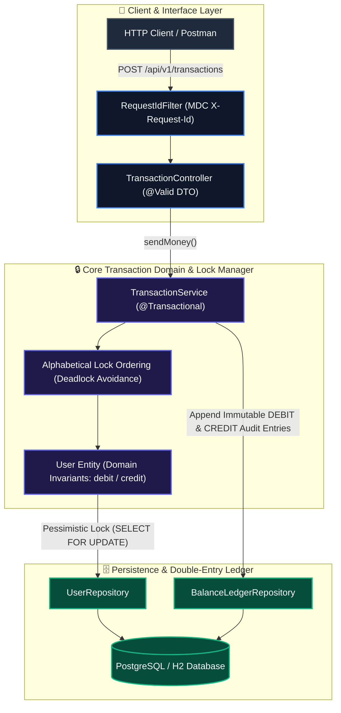

<div align="center">

# ₹ Payflow API

### Enterprise Transaction & Double-Entry Payment Ledger Engine

[](https://github.com/shashankch/payflow-api/actions/workflows/ci.yml)
[](https://dev.java/)
[](https://spring.io/projects/spring-boot)
[](https://junit.org/junit5/)
[](docs/ARCHITECTURE.md)
[](LICENSE)

<p align="center">
  A high-concurrency peer-to-peer payment backend built with <b>Java 25</b> & <b>Spring Boot 4.x</b>.<br>
  Guaranteed zero double-spending • Deterministic row locking • Distributed Redisson locks • Immutable balance ledger
</p>

</div>

---

## 🚀 Key Architectural Pillars

| Architectural Pillar | Core Guarantee & Engineering Mechanics |
| :--- | :--- |
| **🔒 Concurrency Safety** | Row-level pessimistic write locking (`SELECT ... FOR UPDATE`) paired with deterministic alphabetical lock ordering by UPI ID, eliminating race conditions and deadlocks during concurrent account debits and credits. |
| **📜 Double-Entry Ledger** | Atomic paired `DEBIT` and `CREDIT` records with strict base-10 `BigDecimal` arithmetic precision denominated in Indian Rupees (`INR`, symbol: `₹`, scale = 4) and Banker's Rounding (`HALF_EVEN`), preserving an immutable financial audit trail. |
| **🔁 Durable Idempotency** | Mandatory `Idempotency-Key` headers backed by raw SHA-256 payload hashing to prevent tampering, coupled with Redisson distributed locking (`payflow:lock:idemp:{key}`) to coordinate mutations across multi-instance clusters. |
| **🛡️ Resilience & Fault Tolerance** | Dynamic per-user rate limiting (10 req/s, RFC 6585 `Retry-After: 1`), Resilience4j circuit breaking on external banking rails, bounded timeouts, and automatic memory eviction of inactive limiter buckets. |
| **⚡ Transactional Outbox** | Spring Modulith Event Publication Registry atomically persisting domain events (`TransferCompletedEvent`) within the database transaction, bridging to Apache Kafka without dual-write inconsistency. |
| **🔐 Zero-Trust Security** | Stateless HMAC-SHA256 JWT tokens, strict principal-bound sender verification, multi-party access control, non-enumerable UUID reference IDs, and RFC 7807 ProblemDetail error responses. |
| **📊 Enterprise Observability** | Native Elastic Common Schema (ECS) JSON structured logging, MDC trace correlation (`requestId`, `traceId`, `spanId`), Prometheus metrics, and profile-conditional Redis distributed caching with Caffeine local fallback. |

👉 **Architectural Deep-Dives**: Detailed design documents are available in [docs/ARCHITECTURE.md](docs/ARCHITECTURE.md), [docs/adr/](docs/adr/), [SECURITY.md](SECURITY.md), and [CHANGELOG.md](CHANGELOG.md).

---

## 🗺️ Engineering Roadmap

Payflow API evolves through a structured, 12-phase capability roadmap advancing from core transactional domain modeling to distributed systems, Kafka event streaming, containerization, and production Kubernetes orchestration.

📖 **Full Specification & Milestones**: See the complete phase-by-phase deliverables, technical specifications, and status in [**docs/ROADMAP.md**](docs/ROADMAP.md).

---

## 🏗️ System Architecture Overview



---

## 📚 Project Documentation Hub

| Document | Description |
| :--- | :--- |
| 📘 **[System Architecture](docs/ARCHITECTURE.md)** | Deep-dive concurrency models, pessimistic locking mechanics, test pyramid |
| 🛡️ **[Security Architecture & Threat Model](docs/ARCHITECTURE.md#18-security-architecture-and-threat-model)** | Zero-Trust filter chain, STRIDE threat model, IAM policy matrix, financial concurrency controls |
| 🔒 **[Security Policy](SECURITY.md)** | Open-source vulnerability reporting guidelines and project security posture |
| 🗓️ **[Phased Roadmap](docs/ROADMAP.md)** | Full 12-phase technical expansion blueprint |
| 🌐 **[API Specification](docs/API_SPECIFICATION.md)** | Complete REST endpoint contracts, schemas, RFC 7807 payloads |
| 📋 **[Engineering Conventions](docs/CONVENTIONS.md)** | Java 25 standards, Spotless/Checkstyle rules, testing guidelines |
| 📜 **[Architecture Decisions (ADRs)](docs/adr/)** | Master index of modular architectural decision records (ADR-001 through ADR-023) |
| 📝 **[Changelog](CHANGELOG.md)** | Version-by-version implementation notes |

---

## ⚡ Quick Start

### Prerequisites
- **JDK 25** (GraalVM / Temurin recommended)
- **Maven 3.9+**

### Build & Run Tests
```bash
# Verify spotless code format, checkstyle, and run unit & slice tests
mvn clean verify
```

### Launch Local Server
```bash
# Start server with active 'local' profile (H2 in-memory, port 8080)
mvn spring-boot:run
```

- **Swagger UI Interactive Docs**: [http://localhost:8080/swagger-ui.html](http://localhost:8080/swagger-ui.html)
- **OpenAPI 3.0 JSON Specification**: [http://localhost:8080/v3/api-docs](http://localhost:8080/v3/api-docs)
- **H2 Console**: [http://localhost:8080/h2-console](http://localhost:8080/h2-console) (`jdbc:h2:mem:payupidb`, Credentials: `user` / `user`)

---

## 📄 License

This project is licensed under the MIT License — see the [LICENSE](LICENSE) file for details.
