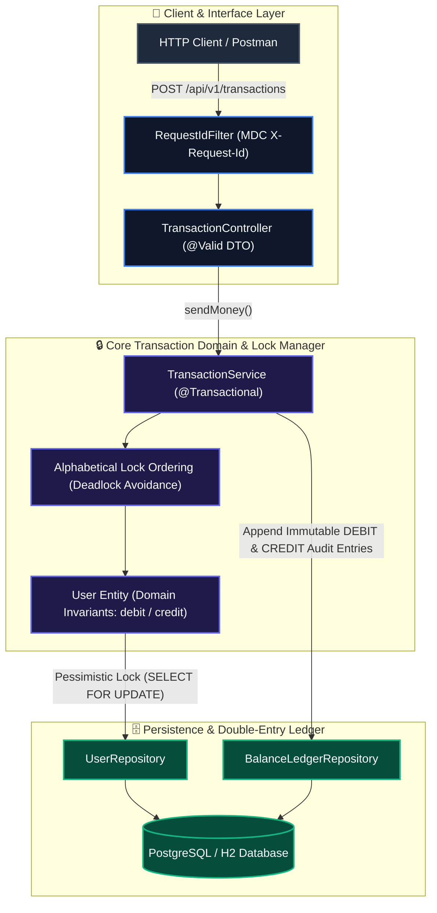

# Payflow API — Enterprise Transaction & Payment Ledger Engine

<p align="left">
  <a href="https://github.com/shashankch/payflow-api/actions/workflows/ci.yml"></a>
  <a href="https://dev.java/"></a>
  <a href="https://spring.io/projects/spring-boot"></a>
  <a href="https://junit.org/junit5/"></a>
  <a href="LICENSE"></a>
</p>

Payflow API is an enterprise-grade peer-to-peer (P2P) payment backend and double-entry transaction ledger built with **Java 25** and **Spring Boot 4.x**. It is engineered to process high-concurrency payment transfers with zero double-spending, guaranteed base-10 financial precision, and complete auditability.

---

## 🚀 Key Architectural Pillars

- **🧪 Multi-Tier Testing Suite (Phase 5A)**: 52 unit, slice, and integration tests passing (`mvn clean verify`), featuring Mockito service isolation (`UserServiceTest`, `TransactionServiceTest`), Data JPA repository slice tests (`@DataJpaTest` with JPQL reconciliation queries), WebMvc slice tests (`@WebMvcTest` with RFC 7807 problem details), and Testcontainers PostgreSQL integration tests (`@Testcontainers`).
- **🐳 Profile Matrix & Testcontainers (Phase 4B)**: Environment profiles (`local`, `test`, `prod`) with production-parity PostgreSQL container testing (`@Testcontainers`, `@DynamicPropertySource`) enforcing schema validation parity between local dev and CI.
- **🗄️ Flyway Migrations & Performance Indexing (Phase 4A)**: Versioned DDL migrations (`V1`..`V4`) managing `users`, `transactions`, and `balance_ledger` schemas with custom performance indexes (`idx_users_upi_id`, `idx_tx_sender_created`, `idx_ledger_user_created`) and Hibernate `ddl-auto=validate` enforcement.
- **🔒 Concurrency Control & Double-Entry Ledger (Phase 3)**: Database write locking (`SELECT ... FOR UPDATE`) with deterministic alphabetical lock ordering by UPI ID to prevent race conditions and cross-transfer deadlocks. Every balance mutation appends immutable `DEBIT`/`CREDIT` audit records.
- **🌐 DTO Isolation & RFC 7807 Error Framework (Phases 1–2)**: Versioned `/api/v1` endpoints exposing Java records, compile-time MapStruct DTO mappings, non-enumerable UUID reference IDs (`referenceId`), and standardized RFC 7807 `ProblemDetail` error payloads.

> 👉 **For the complete feature breakdown, concurrency locking models, and detailed system design, explore [docs/ARCHITECTURE.md](docs/ARCHITECTURE.md) and [CHANGELOG.md](CHANGELOG.md).**

---

## 🗺️ Project Evolution & Roadmap

Payflow API evolves through a structured, multi-phase engineering roadmap:

| Phase | Core Capability | Status |
| :--- | :--- | :--- |
| **Phase 1** | Foundation & Project Hygiene (JDK 25, Spring Boot 4.1, Spotless, Checkstyle) | ✅ Complete |
| **Phase 2** | Domain Modeling, OpenAPI Docs, RFC 7807 Error Handling, UUID References | ✅ Complete |
| **Phase 3** | ACID Transfer Engine, Pessimistic Locking, Double-Entry Balance Ledger | ✅ Complete |
| **Phase 4** | Flyway Database Migrations (`V1`..`V4`), Spring Profiles & Testcontainers | ✅ Complete |
| **Phase 5** | Multi-Tier Test Suite (Unit, `@DataJpaTest`, `@WebMvcTest`, Testcontainers Concurrency) | ✅ Complete |

> 📌 *See full multi-phase evolution details in [docs/ROADMAP.md](docs/ROADMAP.md).*

---

## 🏗️ System Architecture Overview



---

## 📚 Project Documentation Hub

| Document | Description |
| :--- | :--- |
| 📘 **[System Architecture](docs/ARCHITECTURE.md)** | Deep-dive concurrency models, pessimistic locking mechanics, test pyramid |
| 🗓️ **[Phased Roadmap](docs/ROADMAP.md)** | Full 12-phase technical expansion blueprint |
| 🌐 **[API Specification](docs/API_SPECIFICATION.md)** | Complete REST endpoint contracts, schemas, RFC 7807 payloads |
| 📋 **[Engineering Conventions](docs/CONVENTIONS.md)** | Java 25 standards, Spotless/Checkstyle rules, testing guidelines |
| 📜 **[Architecture Decisions (ADRs)](docs/ADR.md)** | Log of architectural decisions (ADR-001 through ADR-014) |
| 📝 **[Changelog](CHANGELOG.md)** | Version-by-version implementation notes |

---

## ⚡ Quick Start

### Prerequisites
- **JDK 25** (GraalVM / Temurin recommended)
- **Maven 3.9+**

### Build & Run Tests
```bash
# Verify spotless code format, checkstyle, and run unit & slice tests
./mvnw clean verify
```

### Launch Local Server
```bash
# Start server with active 'local' profile (H2 in-memory, port 8080)
./mvnw spring-boot:run
```

- **Swagger UI Interactive Docs**: [http://localhost:8080/swagger-ui.html](http://localhost:8080/swagger-ui.html)
- **OpenAPI 3.0 JSON Specification**: [http://localhost:8080/v3/api-docs](http://localhost:8080/v3/api-docs)
- **H2 Console**: [http://localhost:8080/h2-console](http://localhost:8080/h2-console) (`jdbc:h2:mem:payupidb`, Credentials: `user` / `user`)

---

## 📄 License

This project is licensed under the MIT License — see the [LICENSE](LICENSE) file for details.
