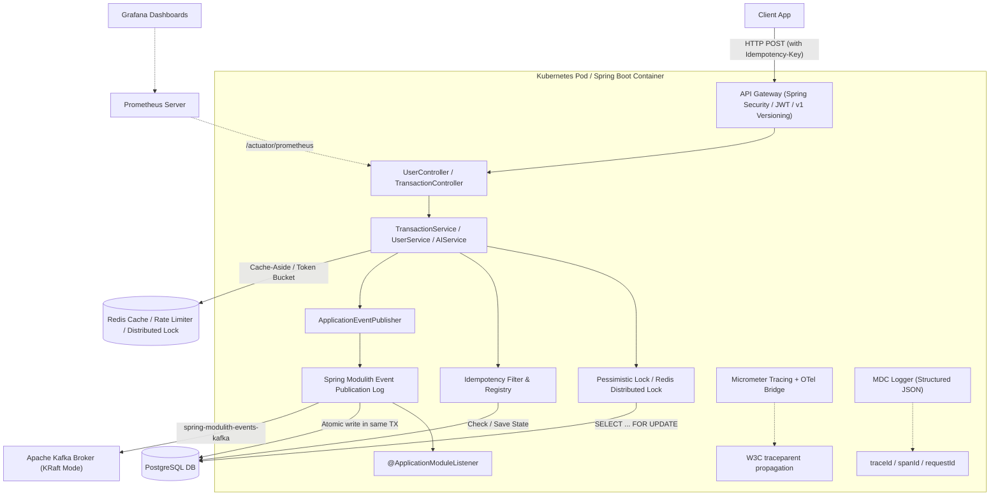

# Payflow API — System Architecture & Design Document

> **Document Metadata**
> - **Title**: Payflow API Core System Architecture & Payment Engine Design
> - **Author**: Payflow Engineering (`shashankchandel@gmail.com`)
> - **Status**: Approved / Living Design Document
> - **Created Date**: 2026-08-01
> - **Last Updated**: 2026-08-07
> - **Authoritative Location**: [ARCHITECTURE.md](ARCHITECTURE.md)
> - **Related Documents**: [API Specification](API_SPECIFICATION.md) | [Architecture Decisions (ADRs)](ADR.md) | [Phased Roadmap](ROADMAP.md) | [Engineering Conventions](CONVENTIONS.md)

---

## Executive Summary & Objective

Payflow API is an enterprise-grade peer-to-peer (P2P) payment backend and transaction ledger designed to process high-concurrency financial transfers with zero double-spending, guaranteed idempotency, and full auditability.

The system is built as a **Spring Modulith modular monolith** — enforcing strict package-level module boundaries while maintaining single-database ACID transactions for financial safety. Domain events are published via Spring's `ApplicationEventPublisher` and persisted atomically through Spring Modulith's Event Publication Registry, enabling a seamless evolutionary path from in-process event handling to Apache Kafka event streaming without modifying domain service code.

The core objective of this system design is to solve the fundamental challenges of payment processing — race conditions during concurrent balance mutations, partial failures during dual-writes (database vs event broker), entity enumeration security risks, and non-deterministic floating-point financial arithmetic — while providing an extensible, cloud-native architecture adaptable from single-server deployments (`prod-light`) to distributed Kubernetes clusters (`prod`).

---

## Business Background & Context

In financial payment systems, balance state corruption or double-spending causes direct monetary loss and loss of customer trust. Traditional CRUD architectures fail under concurrent payment spikes (e.g. flash sales or bill splitting) because uncoordinated database reads and writes lead to race conditions where two simultaneous transactions debit the same starting balance twice.

Furthermore, communicating transaction state to downstream services (such as notification push, fraud monitoring, or rewards engines) via direct HTTP/message calls within a database transaction causes the **dual-write problem**: if the DB commit succeeds but the network call fails, or vice versa, the system enters an inconsistent state.

Payflow solves these challenges through:
1. **Deterministic Lock Ordering**: Alphabetical pessimistic row locking on user accounts to prevent deadlocks and race conditions.
2. **Double-Entry Balance Ledger**: Immutable, append-only ledger entries preserving complete audit trails.
3. **Transactional Outbox Pattern**: Writing outbound events to the database in the same ACID transaction as the state change, eliminating network dual-write failures.
4. **Durable Idempotency Engine**: SHA-256 request payload hashing to intercept and safely replay duplicate network submissions.

---

## Goals & Non-Goals

### Goals
- **Zero Double-Spending**: Guarantee absolute atomicity and isolation for balance transfers under concurrent requests.
- **Financial Precision**: Enforce exact base-10 arithmetic (`BigDecimal`, `precision = 19, scale = 4`) with banker's rounding (`HALF_EVEN`).
- **Exactly-Once Mutation Semantics**: Enforce idempotency on payment endpoints via unique `Idempotency-Key` headers and SHA-256 payload verification.
- **Auditability**: Maintain an append-only transaction and balance ledger history where balances can be independently audited and reconciled.
- **Sub-100ms P95 Latency**: Deliver fast transfer execution under peak concurrent load.
- **Non-Enumerable Entities**: Protect internal primary keys (`Long userId`) by exposing immutable UUID reference IDs (`referenceId`) across all external APIs.

### Non-Goals
- **Multi-Currency / Forex Conversion Engine**: Version 1 is scoped strictly to single-currency transactions (INR). Multi-currency conversion is explicitly out of scope for v1.
- **Physical ATM / Card Issuance Protocol**: Card network rails (Visa/Mastercard ISO 8583) are out of scope.
- **Direct Banking Clearing House Clearing**: Core banking settlement protocols (NPCI/ISO 20022) are mocked via clean domain adapter interfaces.

---

## Service Level Objectives (SLOs) & System Constraints

| Metric | Target / Limit | Enforcement Mechanism |
| :--- | :--- | :--- |
| **Availability** | `99.99%` uptime | Kubernetes multi-pod deployment with health probes |
| **P95 Latency (Transfer)** | `< 100ms` | Index-optimized SQL queries, connection pool tuning |
| **P99 Latency (Transfer)** | `< 250ms` | Deterministic lock ordering, minimal transaction holding time |
| **Throughput Baseline** | `500 TPS` / node | HikariCP pool optimization & Virtual Threads (`Project Loom`) |
| **Double-Spend Tolerance** | `0` (Zero tolerance) | Database pessimistic write locks (`SELECT ... FOR UPDATE`) |
| **Data Retention** | `7 Years` (Audit requirement) | Append-only database ledger & historical partition tables |

---

## 1. System Topology & Core Flow

The diagram below maps the target environment topology, showcasing both the synchronous request-response flow and the asynchronous event-driven pipelines.



---

## 2. Spring Boot Profile Architecture

The system enforces strict execution profiles to maximize scalability and transition seamlessly from a developer's laptop to production clusters:

* **`local` (Default)**: Optimized for zero-dependency local starts. It boots using an in-memory **H2 database** with basic schema generation and mock environment configurations.
* **`test`**: Active during JUnit verification. It disables local startup profiles and utilizes **Testcontainers** to orchestrate isolated Postgres and Kafka instances per test run.
* **`prod`**: Production-grade profile. Schema updates are strictly applied via **Flyway**. External databases (PostgreSQL), memory stores (Redis), and event streaming instances (Kafka) are resolved via Twelve-Factor environment variables.
* **`prod-light` (AWS Free Tier Optimized)**: A memory-restricted deployment profile designed to run on a single constrained AWS virtual server (1 GiB RAM):
  - **Pluggable Redis**: Caching falls back to local in-memory providers (`Caffeine` or `ConcurrentHashMap`), and rate limiting operates in-memory (using Bucket4j local configurations).
  - **Pluggable Kafka**: Drops the Kafka broker dependency. Transaction events are processed internally via Spring `ApplicationEventPublisher` (in-memory queues) or deferred purely inside the Outbox database logs, bypassing JVM broker overhead.

---

## 3. Concurrency Control & Balance Integrity

To prevent double-spending under high request concurrency (e.g., a user submitting multiple transfers simultaneously), Payflow implements two tiers of locking:

### A. Database-Level Pessimistic Locking (Core Ledger)
For balance updates on a single database instance, the transaction service uses database-level pessimistic write locking:
```java
// In UserRepository.java
@Lock(LockModeType.PESSIMISTIC_WRITE)
@Query("SELECT u FROM User u WHERE u.upiId = :upiId")
Optional<User> findByUpiIdWithLock(@Param("upiId") String upiId);
```
*This executes a `SELECT ... FOR UPDATE` query in PostgreSQL, blocking other transactions from modifying these specific rows until the current transaction commits.*
* **Deadlock Avoidance**: Lock acquisition is performed in a deterministic order (e.g., sorting the user UPI IDs alphabetically). This prevents deadlock loops when two users perform mutual transfers at the same time.

### B. Distributed Locking (Cross-Service Coordination)
When transaction logic spans distributed systems (such as reserve balance operations, third-party payment gateways, or rate limiting across multiple application nodes), we introduce a **Redis Distributed Lock (Redlock)** via Redisson:
- **Use Case**: Locking a payment request before database transactions begin, preventing thundering herds and duplicate submission processing at the gateway container boundaries.
- **Failover**: Configured with a short lease time (TTL) to prevent permanent resource locking if a pod node crashes during transaction execution.

### C. Append-Only Double-Entry Balance Ledger
All financial balance operations execute double-entry bookkeeping by persisting two immutable `BalanceLedgerEntry` records (`DEBIT` for sender, `CREDIT` for receiver) within the same `@Transactional` database boundary as the money transfer:
- **Audit Integrity**: Every ledger entry records `amount`, `balanceBefore`, and `balanceAfter`, providing an immutable audit trail for every user balance state transition.
- **Balance Reconciliation**: `users.balance` functions as a high-performance denormalized field. The authoritative source of truth can be validated at any time by executing a reconciliation query over the `balance_ledger` table:
  ```sql
  SELECT COALESCE(SUM(CASE WHEN entry_type = 'CREDIT' THEN amount ELSE -amount END), 0)
  FROM balance_ledger WHERE user_id = :userId;
  ```
- **Immutability**: Once written, ledger rows are never updated or deleted. Reversals or refunds append new `CREDIT`/`DEBIT` ledger rows.

### D. Database Indexing Strategy
To ensure high database read throughput and statement generation speed, the following index constraints are established in Flyway migrations:
- `CREATE UNIQUE INDEX idx_users_upi_id ON users(upi_id);`
- `CREATE UNIQUE INDEX idx_users_reference_id ON users(reference_id);`
- `CREATE INDEX idx_tx_sender_created ON transactions(sender_upi_id, created_at DESC);`
- `CREATE INDEX idx_tx_receiver_created ON transactions(receiver_upi_id, created_at DESC);`
- `CREATE INDEX idx_tx_reference_id ON transactions(reference_id);`
- `CREATE INDEX idx_ledger_user_created ON balance_ledger(user_id, created_at DESC);`

### E. Flyway Versioned Database Migrations
All database DDL changes execute via Flyway versioned SQL scripts located in `src/main/resources/db/migration/`:
- `V1__create_users_table.sql`: Baseline schema for `users` table.
- `V2__create_transactions_table.sql`: Schema for `transactions` table with foreign keys to `users`.
- `V3__create_balance_ledger_table.sql`: Schema for `balance_ledger` double-entry audit table.
- `V4__add_performance_indexes.sql`: Composite and unique indexes for UPI lookups, transaction queries, and ledger audit lookups.

Hibernate is configured to `spring.jpa.hibernate.ddl-auto=validate`, forcing JPA mapping validation against Flyway-managed schema while prohibiting unversioned database mutations in production.

### F. Spring Environment Profiles & Testcontainers Strategy
Configuration is structured cleanly across profile-specific YAML files:

| Profile | Datasource / DB Engine | Flyway | JPA DDL Auto | Primary Purpose |
| :--- | :--- | :--- | :--- | :--- |
| **`local`** | H2 In-Memory (`MODE=PostgreSQL`) | Enabled | `validate` | Instant local dev startup without Docker |
| **`test`** | Testcontainers PostgreSQL (`postgres:16-alpine`) | Enabled | `validate` | 100% production-parity integration testing |
| **`prod`** | External PostgreSQL Cluster | Enabled | `validate` | Production deployment with HikariCP tuning & graceful shutdown |

Integration tests extend `AbstractIntegrationTest`, utilizing `@Testcontainers(disabledWithoutDocker = true)` and `@DynamicPropertySource` to dynamically spin up disposable PostgreSQL containers and bind JDBC credentials, ensuring full schema migration and locking verification against real PostgreSQL.

### G. Comprehensive Multi-Tier Testing Strategy (Pyramid Architecture)

Payflow enforces a multi-tier testing strategy following the standard Test Pyramid:

```
                  / \
                 / IT\        <- Testcontainers PostgreSQL Integration Tests (Phase 4B/5B)
                /-----\
               / Slice \      <- WebMvc (@WebMvcTest) & DataJPA (@DataJpaTest) Slice Tests (Phase 5A)
              /---------\
             / Unit Tests\    <- Mockito Service & MapStruct Mapper Unit Tests (Phase 5A)
            /-------------\
```

1. **Service Unit Tests (Mockito)**: Focus on business domain isolation (`UserServiceTest`, `TransactionServiceTest`). Services are tested with mocked repositories, verifying lock acquisition ordering, balance invariance, domain exception handling, and double-entry ledger creation.
2. **WebMvc Controller Slice Tests (`@WebMvcTest`)**: Focus on HTTP interface contract verification (`UserControllerTest`, `TransactionControllerTest`). Test DTO validation (`422 Unprocessable Entity`), RFC 7807 problem detail error responses, HTTP status codes (`201 Created`, `404 Not Found`), and pagination parameter enforcement.
3. **Data JPA Repository Slice Tests (`@DataJpaTest`)**: Focus on SQL query compilation and repository correctness (`UserRepositoryTest`, `BalanceLedgerRepositoryTest`). Verify custom JPQL/SQL aggregate queries (e.g., balance reconciliation `SUM` queries) and pessimistic lock query execution (`SELECT FOR UPDATE`).
4. **MapStruct Mapper Unit Tests**: Verify zero-loss mapping between JPA entities and public DTO records (`UserMapperTest`, `TransactionMapperTest`, `LedgerMapperTest`).
5. **Concurrency & Integration Tests (Testcontainers PostgreSQL)**: Focus on full-stack integration and high-concurrency race condition testing against real PostgreSQL containers (`TransferLifecycleIT`, `ConcurrentTransferIT`, `MutualTransferDeadlockIT`):
   - **Concurrency Testing (`CountDownLatch`)**: Validates double-spend prevention under simultaneous withdrawal requests. 10 synchronized worker threads attempt to withdraw ₹100 from an account with ₹150 balance at the exact same millisecond. Tests assert that exactly 1 succeeds, 9 fail with `InsufficientBalanceException`, and the final balance is ₹50 (never negative).
   - **Deadlock Avoidance Verification**: Simulates simultaneous mutual cross-transfers ($A \rightarrow B$ and $B \rightarrow A$), proving that deterministic alphabetical lock ordering by UPI ID prevents circular wait deadlocks.
   - **Double-Entry Ledger Reconciliation**: Verifies that aggregate JPQL queries ($\sum\text{CREDIT} - \sum\text{DEBIT}$) across the `balance_ledger` table match `users.balance` at all times.

---

## 4. JPA N+1 Query Resolution

When loading transaction histories (e.g., querying users and their related list of transactions), Hibernate's default lazy loading triggers the **N+1 query problem**:
- 1 query is executed to fetch the page of $N$ users.
- $N$ queries are executed to fetch the transactions for each individual user.

### Resolution Strategy
To maintain a high-performance database connection pool, Payflow resolves this using `@EntityGraph` annotations in Spring Data JPA repositories:
```java
// In TransactionRepository.java
@EntityGraph(attributePaths = {"sender", "receiver"})
Optional<Transaction> findByReferenceId(UUID referenceId);

@EntityGraph(attributePaths = {"sender", "receiver"})
Page<Transaction> findBySenderUpiIdOrReceiverUpiId(String senderUpiId, String receiverUpiId, Pageable pageable);
```
This forces Spring Data JPA to generate a single SQL query with `LEFT OUTER JOIN`s, retrieving the transaction along with its associated `sender` and `receiver` `User` entities in a single database round-trip.

---

## 5. API Versioning Strategy

To support continuous releases and backward compatibility for mobile and third-party integrations, the project enforces **URI-based API versioning**:

- **Format**: `/api/v1/...` (e.g., `POST /api/v1/transactions`).
- **Implementation**: Controllers are explicitly mapped under versioned path prefixes:
  ```java
  @RestController
  @RequestMapping("/api/v1/transactions")
  public class TransactionController { ... }
  ```
- **Deprecation Policy**: Old version routes (e.g., `/api/v1`) remain active until deprecated by major versions (`/api/v2`), routing traffic transparently via the API Gateway.

---

## 6. Durable Idempotency Engine

To guarantee "exactly-once" execution on payment mutations, the system requires clients to pass a unique `Idempotency-Key` header with write requests.

### Idempotency Schema
```sql
CREATE TABLE idempotency_registry (
    idempotency_key VARCHAR(255) PRIMARY KEY,
    request_hash VARCHAR(64) NOT NULL,
    status VARCHAR(50) NOT NULL, -- INITIATED, PROCESSING, SUCCESS, FAILED
    response_body TEXT,
    response_code INT,
    created_at TIMESTAMP WITH TIME ZONE DEFAULT CURRENT_TIMESTAMP,
    updated_at TIMESTAMP WITH TIME ZONE DEFAULT CURRENT_TIMESTAMP
);
```

### Execution Lifecycle
1. **Intercept Request**: Extract `Idempotency-Key` from the header and compute a SHA-256 hash of the request payload.
2. **Lookup Key**: Find the key in the `idempotency_registry`:
   - **Key Not Found**: Insert a new record with status `INITIATED` and the current request hash. Proceed to process the request.
   - **Key Found & status is `PROCESSING`**: Reject the request with `409 Conflict` (indicating the request is already in-flight).
   - **Key Found & status is `SUCCESS`/`FAILED`**: Check the saved `request_hash`. If the payload matches, immediately return the cached response (payload and HTTP code) without executing backend logic. If the payload does not match, reject with `400 Bad Request` (key reuse with different payload).
3. **Update Status**: 
   - Upon successful execution, update status to `SUCCESS` and save the response payload and status code.
   - Upon execution error, update status to `FAILED` or remove the record to allow the client to retry.

---

## 7. Spring Modulith Event Publication & Transactional Outbox

To achieve reliable event-driven messaging, Payflow uses **Spring Modulith's Event Publication Registry** to atomically persist domain events within the same database transaction as the business state change. This eliminates the dual-write problem without requiring custom outbox infrastructure.

### Event Publication Flow
```
[Start @Transactional]
   │
   ├── 1. Update User Balance (SQL)
   ├── 2. Save Transaction Record (SQL)
   ├── 3. applicationEventPublisher.publishEvent(TransferCompletedEvent)
   │      └── Spring Modulith writes to `event_publication` table (same TX)
   │
[Commit Transaction] --> Atomically persists everything locally
   │
   └── [Post-Commit Async Processing]
          │
          ├── @ApplicationModuleListener receives event (in-process, local/test profiles)
          │     └── Logging, audit trail, notification triggers
          │
          └── spring-modulith-events-kafka (prod profile, Phase 9A)
                └── Auto-externalizes event to Kafka topic `payflow.transfers`
```

### Evolutionary Architecture Path

| Stage | Profile | Event Handling | Kafka Required? |
| :--- | :--- | :--- | :--- |
| **Phase 6B** | `local` / `test` | In-process `@ApplicationModuleListener` | No |
| **Phase 9A** | `prod` | Auto-externalized to Kafka via `spring-modulith-events-kafka` | Yes |
| **Phase 12A** | `prod-light` | In-process (no Kafka, single-server deployment) | No |

This design ensures that domain service code (`TransactionService.sendMoney()`) **never changes** regardless of whether events are consumed in-process or streamed to Kafka. The Spring Modulith framework handles the routing transparently based on active Spring profiles.

---

## 8. Gen-AI Spend Insights & Categorization

To support smart financial features, the project includes an **AI spend assistant** integration using **Spring AI** connected to an LLM provider API:

- **AI Categorization**: An asynchronous listener or dedicated endpoint reads transaction metadata and recent `BalanceLedgerEntry` history (amounts, merchant UPI names, transaction notes, DEBIT/CREDIT classifications) and passes a structured prompt to the LLM to map transactions into structured categories (e.g., `Groceries`, `Utilities`, `Entertainment`, `Dining`).
- **Structured JSON Schema**: Prompts leverage the LLM's structured JSON output mode to force the response directly into a predefined JSON schema mapping, preventing formatting errors.
- **Budgeting Insights**: Generates automated personal budgeting recommendations based on the user's double-entry balance ledger audit history via clean prompt engineering and LLM integrations.

---

## 9. Resilience Policies & Thread Tuning

System stability under load is enforced using **Resilience4j** configurations:

* **Rate Limiting**: Enforced at the controller layer via a Redis-backed Token Bucket algorithm. Limits mutations to prevent denial-of-service attempts.
* **Connection & Read Timeouts**: Explicit timeouts configured on the HTTP clients and database connections to prevent thread pool depletion.
* **Retries & Backoff**: Outbound requests (e.g. to third-party banking processors) are wrapped in Resilience4j Retry policies using **exponential backoff with random jitter** to prevent thundering herd requests on recovering downstream hosts.
* **Virtual Threads Integration (Project Loom)**:
  Java 25 virtual threads are enabled to handle high request-response volumes:
  ```properties
  spring.threads.virtual.enabled=true
  ```
  Since virtual threads do not block OS kernel threads, throughput scales efficiently. However, to prevent database pool exhaustion, HikariCP's maximum pool size must be explicitly configured and aligned with Postgres threshold capabilities (e.g., `maximum-pool-size=20`).

---

## 10. Kubernetes Readiness & Pod Lifecycle

The application complies with cloud-native deployment requirements when running in a Kubernetes cluster:

* **Graceful Shutdown**: Enabled using Spring properties:
  ```properties
  server.shutdown=graceful
  ```
  Upon receiving a `SIGTERM` signal, the container stops routing new requests but allows existing, in-flight transaction threads to complete (up to the configured `terminationGracePeriodSeconds` in the Kubernetes pod spec, recommended at `30s`).
* **Health Probes**: Spring Boot Actuator isolates Kubernetes-native endpoints:
  - **Liveness Probe** (`/actuator/health/liveness`): Confirms the application process is running.
  - **Readiness Probe** (`/actuator/health/readiness`): Verifies database connectivity, cache connections, and messaging broker availability.

---

## 11. Observability Stack

Payflow implements the **Three Pillars of Observability** — Metrics, Tracing, and Logging — using industry-standard open-source tooling:

### A. Distributed Tracing (OpenTelemetry)
- **Micrometer Tracing** with the **OpenTelemetry bridge** (`micrometer-tracing-bridge-otel`) automatically injects W3C-standard `traceparent` headers (`traceId`, `spanId`) across HTTP controllers, database queries, and async thread pools.
- The existing `X-Request-Id` correlation (Phase 2D) is preserved and coexists with W3C trace context, providing both custom and standards-based correlation.
- Compatible with **Grafana Tempo**, **Jaeger**, or any OTLP-compatible tracing backend.

### B. Metrics (Prometheus + Grafana)
- **System Metrics**: JVM garbage collection, thread pool depth, HikariCP connection pool saturation — all auto-exported via Micrometer.
- **Business Metrics**: Custom counters and timers track real-time transfer TPS (`payflow.transfers.total`), latency percentiles (`payflow.transfers.latency` — p50/p95/p99), and failure breakdowns by exception type.
- **Prometheus** scrapes `/actuator/prometheus`; **Grafana** dashboards visualize transfer volume, error rates, and infrastructure health.

### C. Structured Logging (MDC Correlation)
- Logback configured with JSON-structured output including MDC fields (`traceId`, `spanId`, `requestId`, `userId`).
- Every log line is automatically correlated with the distributed trace, enabling click-through from a Grafana dashboard metric spike to the exact log lines across the request lifecycle.

---

## 12. Testing Strategy (Rigor, Concurrency & Unit Verification)

To ensure maximum code coverage and high system reliability, the project defines a two-tier testing strategy consisting of isolated unit tests and full-stack integration tests.

### A. Isolated Unit Testing Strategy
Unit tests focus on isolating individual components and verifying business logic without booting the database or messaging middleware:

1. **Controller Layer (MockMVC)**:
   - Evaluates HTTP serialization, URL routing, request DTO validation constraints (e.g. invalid UPI patterns, blank fields), and custom error mapping to RFC 7807 payloads.
   - Tested using Spring's `@WebMvcTest` paired with `@MockitoBean` (standard in Spring Boot 4.1.x) to stub the service layers, ensuring lightning-fast execution.
2. **Service Layer (Mockito)**:
   - Validates business rules, balance invariant checking, and custom exceptions throwing (e.g., `UserNotFoundException` or `InsufficientBalanceException`).
   - Uses Mockito annotations (`@ExtendWith(MockitoExtension.class)`) to isolate business service operations from Spring lifecycle overhead.
3. **Repository Layer (DataJpaTest)**:
   - Confirms that custom derived queries or complex JPQL Fetch Joins compile and execute successfully.
   - Executed via `@DataJpaTest` running against an embedded H2 database instance.
4. **Mocking External Services**:
   - Outbound REST endpoints (UPI validation via HTTP Interface Client), the AI model assistant API, and Kafka brokers are mocked or stubbed during unit verification using WireMock and MockRestServiceServer to prevent flaky test execution and external network dependence.

### B. Advanced Integration Testing (Rigor & Concurrency Verification)
Integration tests verify the full lifecycle of a transaction across actual container dependencies using **Testcontainers** to orchestrate PostgreSQL and Kafka instances during Maven build phases:

1. **Concurrent Race Condition Testing**:
   - To verify pessimistic row lock deadlocks and double-spend safety under high traffic contention:
     - Initialize an `ExecutorService` with a thread pool (size: 10) and a `CountDownLatch` set to 10.
     - Fire 10 concurrent threads at the same millisecond to withdraw $100 from a sender account holding $150.
     - **Assertion**: Only 1 transaction commits successfully, 9 threads fail with validation or locking errors, and the final account balance is exactly $50.
2. **Idempotency Key Lock Contention Testing**:
   - To verify that gateway-level locks block dual-processing on duplicate submissions:
     - Spin up two concurrent threads executing a transaction using the same `Idempotency-Key` and request payload.
     - **Assertion**: Thread 1 succeeds; Thread 2 is immediately rejected with a `409 Conflict` (custom `IdempotentRequestProcessingException`) without starting any database transaction, proving the gateway Redis lock isolated the duplicate execution path.
3. **Spring Modulith Event Publication Testing**:
   - Confirms domain events published via `ApplicationEventPublisher` are atomically persisted to the event publication log and consumed by `@ApplicationModuleListener` handlers.
   - **Assertion**: Execute a transfer, verify `TransferCompletedEvent` appears in the event publication table within the same database transaction. Verify Kafka externalization (prod profile) via Testcontainers Kafka consumer.

---

## 13. Entity Model & Rich Domain Architecture

To establish robust domain boundaries and prevent corrupt data state, the entity layer adheres to Rich Domain Model principles and precise database constraints:

### A. Financial Precision (`BigDecimal`)
All monetary columns (`balance`, `amount`) are represented using `BigDecimal` mapped to database column definition `@Column(precision = 19, scale = 4, nullable = false)`. Floating-point binary arithmetic primitives (`double`, `float`) are prohibited to eliminate representation error accumulation.

### B. Rich Domain Invariants
Entities encapsulate their own business invariants and state transitions:
- **`User.debit(BigDecimal amount)`**: Enforces positive debit amounts and verifies balance adequacy (`balance >= amount`). Throws `IllegalStateException` or domain exceptions if invariants fail.
- **`User.credit(BigDecimal amount)`**: Enforces positive credit amounts and updates account balance atomically in-memory.

### C. Auditability & Optimistic Locking
- **Audit Timestamps**: `@CreationTimestamp Instant createdAt` and `@UpdateTimestamp Instant updatedAt` automatically track record creation and updates.
- **Optimistic Locking**: `@Version Long version` enables Hibernate to prevent lost updates during concurrent non-locking state updates.

### D. Relational Foreign Key Integrity
The `Transaction` entity maintains explicit JPA `@ManyToOne(fetch = FetchType.LAZY)` foreign key relationships to `User` for `sender` and `receiver`, while retaining denormalized `senderUpiId` and `receiverUpiId` fields for index-optimized queries.

---

## 14. External Service Integration (RestClient & HTTP Interface Client)

Payflow validates UPI IDs against an external validation service during user registration using modern Spring outbound HTTP communication patterns:

### A. RestClient (Spring Framework 7)
`RestClient` is the modern synchronous HTTP client that replaces the deprecated `RestTemplate`. It provides a fluent, immutable API with built-in error handling and serialization support.

### B. HTTP Interface Client
Payflow defines outbound API contracts as declarative Java interfaces using `@GetExchange` / `@PostExchange` annotations:

```java
public interface UpiValidationClient {
    @GetExchange("/verify/{upiId}")
    UpiVerificationResponse verify(@PathVariable String upiId);
}
```

Spring generates the implementation proxy backed by `RestClient` at runtime — conceptually similar to OpenFeign but fully Spring-native with zero external dependencies.

### C. Resilience (Framework 7 Native @Retryable)
Outbound HTTP calls are wrapped with Framework 7's native `@Retryable` annotation (now part of `spring-core`) providing exponential backoff with jitter:

```
Attempt 1 → timeout → wait 500ms
Attempt 2 → timeout → wait ~1000ms (with jitter)
Attempt 3 → success or fallback
```

Graceful fallback: if the UPI validation service is unavailable, registration proceeds with a warning log — external service failures never block core user onboarding.

### D. HTTP Client Comparison Matrix
| Client | Era | Model | Use Case |
| :--- | :--- | :--- | :--- |
| `RestTemplate` | Spring 3 (deprecated in FW7) | Imperative, verbose | Legacy codebases |
| `RestClient` | Spring 6.1+ | Fluent, synchronous | Modern blocking apps |
| `WebClient` | Spring 5+ | Reactive, non-blocking | Reactive pipelines / streaming |
| HTTP Interface Client | Spring 6+ (enhanced in FW7) | Declarative proxy | Clean API contracts, replaces Feign |
| OpenFeign | Spring Cloud | Declarative proxy (external lib) | Legacy Cloud-native apps |

---

## 15. Security, Privacy & Threat Modeling

Payment backends operate under strict security and regulatory requirements. The system architecture addresses key threat vectors:

### A. Threat Matrix & Mitigations
| Threat Vector | Severity | Architectural Mitigation |
| :--- | :--- | :--- |
| **Resource Enumeration** | High | Non-enumerable `UUID referenceId` used in all external URLs and API response payloads instead of auto-incrementing database IDs (`userId`). |
| **Double-Spending / Race Condition** | Catastrophic | Pessimistic DB write locks (`SELECT ... FOR UPDATE`) with deterministic lock acquisition order (alphabetical sorting by UPI ID). |
| **Replay Attacks** | High | Mandatory `Idempotency-Key` headers on mutation endpoints backed by SHA-256 request body hashing. |
| **Unauthorized Transfers** | Critical | JWT bearer token verification matching authenticated subject against sender identity (Phase 7B). |
| **Log Data Leakage (PII/Financial)** | Medium | MDC logging filter strips sensitive fields (card numbers, PINs) and loggers only log `X-Request-Id` correlation context. |

### B. Privacy & Compliance Controls
- **TLS 1.3 Transport Security**: Mandatory for all external gateway ingress traffic.
- **Sanitized Error Responses**: Production error handlers return standard RFC 7807 `ProblemDetail` bodies without exposing raw SQL errors, stack traces, or internal server directory paths.

---

## 16. Alternatives Considered & Trade-off Analysis

Documenting rejected alternatives and evaluating the penalty ("cost of getting it wrong") is critical to preventing architectural regressions.

| Decision Area | Chosen Solution | Alternative Considered | Cost of Getting It Wrong (Penalty) | Why Alternative Was Rejected |
| :--- | :--- | :--- | :--- | :--- |
| **Financial Precision** | `BigDecimal` | `double` / `float` | **Catastrophic**: Cumulative floating-point rounding errors lead to un-reconcilable ledger balances. | Binary floating-point cannot represent base-10 decimals exactly (`0.1 + 0.2 != 0.3`). |
| **Concurrency Control** | Deterministic Pessimistic Locking | Optimistic Locking (`@Version`) | **High**: Under flash-sale high concurrency, optimistic lock collisions cause high transaction abort/retry rates and poor user experience. | Optimistic locking is ideal for read-heavy workloads; money transfers are write-contended on popular seller accounts. |
| **Event Publishing** | Spring Modulith Event Publication Registry | Direct Publish (Service calls Kafka inside `@Transactional`) | **High**: Network failure to Kafka causes rollback of DB transaction or lost events (Dual-write problem). | Direct publishing breaks transactional atomicity between DB state and messaging topics. |
| **Event Publishing** | Spring Modulith Event Publication Registry | Hand-rolled outbox table + `SKIP LOCKED` polling | **Medium**: Custom outbox code requires boilerplate polling dispatcher, manual completion tracking, and retry logic. | Spring Modulith provides framework-managed event persistence, completion callbacks, and transparent Kafka bridging. |
| **API Identification** | Opaque `UUID referenceId` | Exposed `Long userId` | **Medium**: Attackers enumerate total user count and scrape user data via `/api/v1/users/1`, `/2`, `/3`. | Auto-increment IDs leak business metrics and expose predictable resource endpoints. |
| **DTO Serialization** | MapStruct (Compile-time) | Reflection (e.g. `BeanUtils.copyProperties`) | **Medium**: Runtime reflection errors, zero compile-time safety, poor performance under high TPS. | MapStruct generates clean, zero-reflection Java bytecode during Maven build with strict type checking. |

---

## 17. Open & Resolved Design Issues

### Resolved Design Decisions
- **`RES-001`: MapStruct for DTO Mapping** — Resolved in Phase 2C. Replaced custom manual factories with type-safe MapStruct mappers.
- **`RES-002`: RFC 7807 Error Standard** — Resolved in Phase 2D. Standardized all exception responses on Spring `ProblemDetail`.
- **`RES-003`: User Reference IDs** — Resolved in Phase 2E. Added `UUID referenceId` to `User` entity to insulate API boundaries from auto-increment IDs.
- **`RES-004`: Modular Monolith over Microservices** — Resolved in architecture review. Spring Modulith enforces module boundaries while preserving single-database ACID safety for financial transactions.
- **`RES-005`: OpenTelemetry over Vendor-Specific Tracing** — Resolved in architecture review. Micrometer Tracing + OTel bridge provides portable, W3C-standard distributed tracing.
- **`RES-006`: RestClient + HTTP Interface Client over RestTemplate** — Resolved in architecture review. `RestTemplate` is deprecated in Framework 7; `RestClient` + declarative `@GetExchange`/`@PostExchange` interfaces are the modern standard.
- **`RES-007`: Framework 7 @Retryable + Resilience4j Complementary Use** — Resolved in architecture review. Use spring-core native `@Retryable` for basic outbound HTTP retry; use Resilience4j for advanced patterns (per-user rate limiting, circuit breakers) not yet in spring-core.

### Open Questions & Future Evaluation
- **`OPEN-001`: Transfer Amount Cap Configuration** — Default cap set to ₹1,00,000 (`100,000.00`). Evaluating whether per-user dynamic velocity caps should be stored in Redis.
