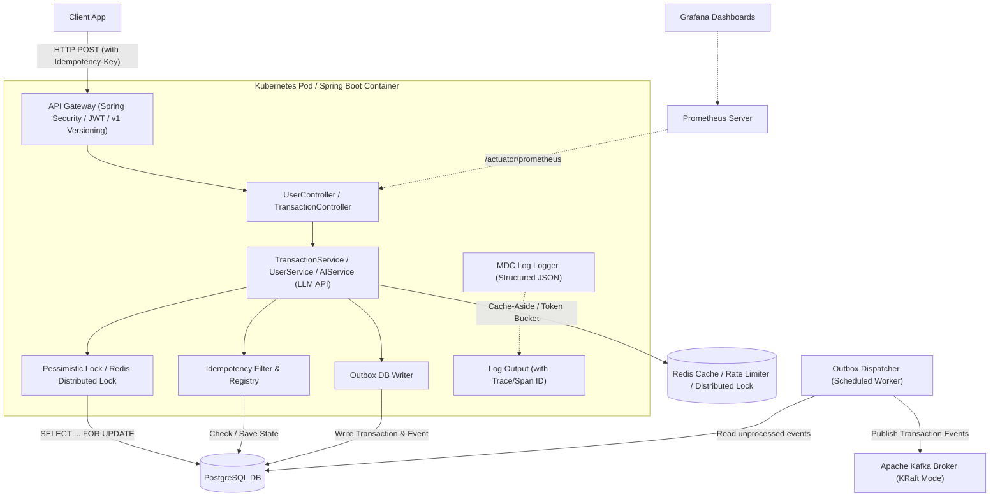

# Payflow API — System Architecture

This document describes the runtime design, technical patterns, and architecture conventions of the Payflow API payment backend.

---

## 1. System Topology & Core Flow

The diagram below maps the target environment topology, showcasing both the synchronous request-response flow and the asynchronous event-driven pipelines.



---

## 2. Spring Boot Profile Architecture

The system enforces strict execution profiles to maximize scalability and transition seamlessly from a developer's laptop to production clusters:

* **`local` (Default)**: Optimized for zero-dependency local starts. It boots using an in-memory **H2 database** with basic schema generation and mock environment configurations.
* **`test`**: Active during JUnit verification. It disables local startup profiles and utilizes **Testcontainers** to orchestrate isolated Postgres and Kafka instances per test run.
* **`prod`**: Production-grade profile. Schema updates are strictly applied via **Flyway**. External databases (PostgreSQL), memory stores (Redis), and event streaming instances (Kafka) are resolved via Twelve-Factor environment variables.
* **`prod-light` (AWS Free Tier Optimized)**: A memory-restricted deployment profile designed to run on a single constrained AWS virtual server (1 GiB RAM):
  - **Pluggable Redis**: Caching falls back to local in-memory providers (`Caffeine` or `ConcurrentHashMap`), and rate limiting operates in-memory (using Bucket4j local configurations).
  - **Pluggable Kafka**: Drops the Kafka broker dependency. Transaction events are processed internally via Spring `ApplicationEventPublisher` (in-memory queues) or deferred purely inside the Outbox database logs, bypassing JVM broker overhead.

---

## 3. Concurrency Control & Balance Integrity

To prevent double-spending under high request concurrency (e.g., a user submitting multiple transfers simultaneously), Payflow implements two tiers of locking:

### A. Database-Level Pessimistic Locking (Core Ledger)
For balance updates on a single database instance, the transaction service uses database-level pessimistic write locking:
```java
// In UserRepository.java
@Lock(LockModeType.PESSIMISTIC_WRITE)
@Query("SELECT u FROM User u WHERE u.upiId = :upiId")
Optional<User> findByUpiIdWithLock(@Param("upiId") String upiId);
```
*This executes a `SELECT ... FOR UPDATE` query in PostgreSQL, blocking other transactions from modifying these specific rows until the current transaction commits.*
* **Deadlock Avoidance**: Lock acquisition is performed in a deterministic order (e.g., sorting the user UPI IDs alphabetically). This prevents deadlock loops when two users perform mutual transfers at the same time.

### B. Distributed Locking (Cross-Service Coordination)
When transaction logic spans distributed systems (such as reserve balance operations, third-party payment gateways, or rate limiting across multiple application nodes), we introduce a **Redis Distributed Lock (Redlock)** via Redisson:
- **Use Case**: Locking a payment request before database transactions begin, preventing thundering herds and duplicate submission processing at the gateway container boundaries.
- **Failover**: Configured with a short lease time (TTL) to prevent permanent resource locking if a pod node crashes during transaction execution.

---

## 4. JPA N+1 Query Resolution

When loading transaction histories (e.g., querying users and their related list of transactions), Hibernate's default lazy loading triggers the **N+1 query problem**:
- 1 query is executed to fetch the page of $N$ users.
- $N$ queries are executed to fetch the transactions for each individual user.

### Resolution Strategy
To maintain a high-performance database connection pool, Payflow prevents this by using explicit **Fetch Joins** or `@EntityGraph` definitions in repositories:
```java
// In UserRepository.java
@EntityGraph(attributePaths = {"transactions"})
@Query("SELECT u FROM User u WHERE u.userId = :id")
Optional<User> findUserWithTransactions(@Param("id") Long id);
```
This forces Spring Data JPA to generate a single SQL query with an `INNER JOIN` or `LEFT JOIN`, retrieving the user and their associated transactions in a single database round-trip.

---

## 5. API Versioning Strategy

To support continuous releases and backward compatibility for mobile and third-party integrations, the project enforces **URI-based API versioning**:

- **Format**: `/api/v1/...` (e.g., `POST /api/v1/transactions`).
- **Implementation**: Controllers are explicitly mapped under versioned path prefixes:
  ```java
  @RestController
  @RequestMapping("/api/v1/transactions")
  public class TransactionController { ... }
  ```
- **Deprecation Policy**: Old version routes (e.g., `/api/v1`) remain active until deprecated by major versions (`/api/v2`), routing traffic transparently via the API Gateway.

---

## 6. Durable Idempotency Engine

To guarantee "exactly-once" execution on payment mutations, the system requires clients to pass a unique `Idempotency-Key` header with write requests.

### Idempotency Schema
```sql
CREATE TABLE idempotency_registry (
    idempotency_key VARCHAR(255) PRIMARY KEY,
    request_hash VARCHAR(64) NOT NULL,
    status VARCHAR(50) NOT NULL, -- INITIATED, PROCESSING, SUCCESS, FAILED
    response_body TEXT,
    response_code INT,
    created_at TIMESTAMP WITH TIME ZONE DEFAULT CURRENT_TIMESTAMP,
    updated_at TIMESTAMP WITH TIME ZONE DEFAULT CURRENT_TIMESTAMP
);
```

### Execution Lifecycle
1. **Intercept Request**: Extract `Idempotency-Key` from the header and compute a SHA-256 hash of the request payload.
2. **Lookup Key**: Find the key in the `idempotency_registry`:
   - **Key Not Found**: Insert a new record with status `INITIATED` and the current request hash. Proceed to process the request.
   - **Key Found & status is `PROCESSING`**: Reject the request with `409 Conflict` (indicating the request is already in-flight).
   - **Key Found & status is `SUCCESS`/`FAILED`**: Check the saved `request_hash`. If the payload matches, immediately return the cached response (payload and HTTP code) without executing backend logic. If the payload does not match, reject with `400 Bad Request` (key reuse with different payload).
3. **Update Status**: 
   - Upon successful execution, update status to `SUCCESS` and save the response payload and status code.
   - Upon execution error, update status to `FAILED` or remove the record to allow the client to retry.

---

## 7. Transactional Outbox Pattern

To achieve reliable event-driven messaging, Payflow separates business state updates from event publishing to ensure transactional integrity (solving the dual-write problem).

### Outbox Pattern Design
```
[Start Transaction]
   │
   ├── 1. Update User Balance (SQL)
   ├── 2. Save Transaction Record (SQL)
   ├── 3. Write Event to "outbox_table" (SQL)
   │
[Commit Transaction] --> Atomically persists everything locally
   │
   └── [Asynchronous Process]
          │
          ├── 1. Read unprocessed events from "outbox_table"
          ├── 2. Publish events to Kafka topic
          └── 3. Mark events as processed (or delete) in DB
```

### Outbox Table Schema
```sql
CREATE TABLE outbox_events (
    event_id UUID PRIMARY KEY,
    aggregate_type VARCHAR(100) NOT NULL, -- e.g., "TRANSACTION"
    aggregate_id VARCHAR(100) NOT NULL,   -- e.g., transactionId
    event_type VARCHAR(100) NOT NULL,     -- e.g., "TRANSACTION_COMPLETED"
    payload JSONB NOT NULL,
    status VARCHAR(50) NOT NULL,          -- PENDING, DISPATCHED, FAILED
    created_at TIMESTAMP WITH TIME ZONE DEFAULT CURRENT_TIMESTAMP
);
```

---

## 8. Gen-AI Spend Insights & Categorization

To support smart financial features, the project includes an **AI spend assistant** integration using **Spring AI** connected to an LLM provider API:

- **AI Categorization**: An asynchronous listener or dedicated endpoint reads transaction metadata (amounts, merchant UPI names, transaction notes) and passes a structured prompt to the LLM to map the transaction into structured categories (e.g., `Groceries`, `Utilities`, `Entertainment`, `Dining`).
- **Structured JSON Schema**: Prompts leverage the LLM's structured JSON output mode to force the response directly into a predefined JSON schema mapping, preventing formatting errors.
- **Budgeting Insights**: Generates automated personal budgeting recommendations based on the user's recent transaction history, providing recruiters with an example of clean prompt engineering and LLM integrations.

---

## 9. Resilience Policies

System stability under load is enforced using **Resilience4j** configurations:

* **Rate Limiting**: Enforced at the controller layer via a Redis-backed Token Bucket algorithm. Limits mutations to prevent denial-of-service attempts.
* **Connection & Read Timeouts**: Explicit timeouts configured on the HTTP clients and database connections to prevent thread pool depletion:
  ```properties
  spring.datasource.hikari.connection-timeout=5000 # 5 seconds max connection wait
  spring.datasource.hikari.maximum-pool-size=20     # Sized relative to virtual threads
  ```
* **Retries & Backoff**: Outbound requests (e.g. to third-party banking processors) are wrapped in Resilience4j Retry policies using **exponential backoff with random jitter** to prevent thundering herd requests on recovering downstream hosts.

---

## 10. Kubernetes Readiness & Pod Lifecycle

The application complies with cloud-native deployment requirements when running in a Kubernetes cluster:

* **Graceful Shutdown**: Enabled using Spring properties:
  ```properties
  server.shutdown=graceful
  ```
  Upon receiving a `SIGTERM` signal, the container stops routing new requests but allows existing, in-flight transaction threads to complete (up to the configured `terminationGracePeriodSeconds` in the Kubernetes pod spec, recommended at `30s`).
* **Health Probes**: Spring Boot Actuator isolates Kubernetes-native endpoints:
  - **Liveness Probe** (`/actuator/health/liveness`): Confirms the application process is running.
  - **Readiness Probe** (`/actuator/health/readiness`): Verifies database connectivity, cache connections, and messaging broker availability.

---

## 11. Observability Stack

* **Log Correlation (MDC)**: The logger is configured with a standard pattern using Spring Boot's Mapped Diagnostic Context (MDC). Every log line includes `traceId`, `spanId`, and `userId` context, enabling automated log correlation in tracing systems.
* **Prometheus Metrics**: Actuator exposes metrics under `/actuator/prometheus`, providing telemetry on transaction volumes, payment failures, JVM garbage collection, and database connection pool saturation.
