# Payflow API — System Architecture & Design Document

!!! info "Document Metadata"
    - **Title**: Payflow API Core System Architecture & Payment Engine Design
    - **Author**: Payflow Engineering (shashakchandel@gmail.com)
    - **Status**: Approved / Living Design Document
    - **Created Date**: 2026-08-01
    - **Last Updated**: 2026-09-30
    - **Authoritative Location**: [ARCHITECTURE.md](ARCHITECTURE.md)
    - **Related Documents**: [API Specification](API_SPECIFICATION.md) | [Security Policy](SECURITY.md) | [Architecture Decisions (ADRs)](adr/README.md) | [Phased Roadmap](ROADMAP.md) | [Engineering Conventions](CONVENTIONS.md)

---

## Executive Summary & Objective

Payflow API is an enterprise-grade peer-to-peer (P2P) payment backend and transaction ledger designed to process high-concurrency financial transfers with zero double-spending, guaranteed idempotency, and full auditability.

The system is built as a **Spring Modulith modular monolith** — enforcing strict package-level module boundaries while maintaining single-database ACID transactions for financial safety. Domain events are published via Spring's `ApplicationEventPublisher` and persisted atomically through Spring Modulith's Event Publication Registry, enabling a seamless evolutionary path from in-process event handling to Apache Kafka event streaming without modifying domain service code.

The core objective of this system design is to solve the fundamental challenges of payment processing — race conditions during concurrent balance mutations, partial failures during dual-writes (database vs event broker), entity enumeration security risks, and non-deterministic floating-point financial arithmetic — while providing an extensible, cloud-native architecture adaptable from single-server deployments (`prod-light`) to distributed Kubernetes clusters (`prod`).

---

## Business Background & Context

In financial payment systems, balance state corruption or double-spending causes direct monetary loss and loss of customer trust. Traditional CRUD architectures fail under concurrent payment spikes (e.g. flash sales or bill splitting) because uncoordinated database reads and writes lead to race conditions where two simultaneous transactions debit the same starting balance twice.

Furthermore, communicating transaction state to downstream services (such as notification push, fraud monitoring, or rewards engines) via direct HTTP/message calls within a database transaction causes the **dual-write problem**: if the DB commit succeeds but the network call fails, or vice versa, the system enters an inconsistent state.

Payflow solves these challenges through:

1. **Deterministic Lock Ordering**: Alphabetical pessimistic row locking on user accounts to prevent deadlocks and race conditions.
2. **Double-Entry Balance Ledger**: Immutable, append-only ledger entries preserving complete audit trails.
3. **Transactional Outbox Pattern**: Writing outbound events to the database in the same ACID transaction as the state change, eliminating network dual-write failures.
4. **Durable Idempotency Engine**: SHA-256 request payload hashing to intercept and safely replay duplicate network submissions.

---

## Goals & Non-Goals

### Goals

- **Zero Double-Spending**: Guarantee absolute atomicity and isolation for balance transfers under concurrent requests.
- **Financial Precision**: Enforce exact base-10 arithmetic (`BigDecimal`, `precision = 19, scale = 4`) with banker's rounding (`HALF_EVEN`).
- **Exactly-Once Mutation Semantics**: Enforce idempotency on payment endpoints via unique `Idempotency-Key` headers and SHA-256 payload verification.
- **Auditability**: Maintain an append-only transaction and balance ledger history where balances can be independently audited and reconciled.
- **Sub-100ms P95 Latency**: Deliver fast transfer execution under peak concurrent load.
- **Non-Enumerable Entities**: Protect internal primary keys (`Long userId`) by exposing immutable UUID reference IDs (`referenceId`) across all external APIs.

### Non-Goals

- **Multi-Currency / Forex Conversion Engine**: Version 1 is scoped strictly to single-currency transactions in Indian Rupees (INR, symbol: ₹). Multi-currency conversion is explicitly out of scope for v1.
- **Physical ATM / Card Issuance Protocol**: Card network rails (Visa/Mastercard ISO 8583) are out of scope.
- **Direct Banking Clearing House Clearing**: Core banking settlement protocols (NPCI/ISO 20022) are mocked via clean domain adapter interfaces.

---

## Service Level Objectives (SLOs) & System Constraints

| Metric | Target / Limit | Enforcement Mechanism |
| :--- | :--- | :--- |
| **Availability** | `99.99%` uptime | Kubernetes multi-pod deployment with health probes |
| **P95 Latency (Transfer)** | `< 100ms` | Index-optimized SQL queries, connection pool tuning |
| **P99 Latency (Transfer)** | `< 250ms` | Deterministic lock ordering, minimal transaction holding time |
| **Throughput Baseline** | `500 TPS` / node | HikariCP pool optimization & Virtual Threads (`Project Loom`) |
| **Double-Spend Tolerance** | `0` (Zero tolerance) | Database pessimistic write locks (`SELECT ... FOR UPDATE`) |
| **Data Retention** | `7 Years` (Audit requirement) | Append-only database ledger & historical partition tables |

---

## 1. System Topology & Core Flow

The diagram below maps the target environment topology, showcasing both the synchronous request-response flow and the asynchronous event-driven pipelines.

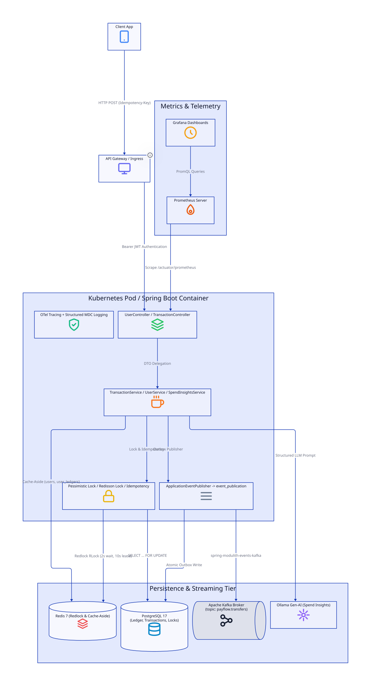

<details>
<summary>📐 View Declarative D2 Diagram Source</summary>

```d2
direction: down

client: Client App {
  shape: rectangle
  icon: "docs/assets/icons/client.svg"
}

gateway: API Gateway / Ingress {
  shape: rectangle
  icon: "docs/assets/icons/gateway.svg"
  tooltip: "Spring Security / JWT / v1 Versioning"
}

client -> gateway: "HTTP POST (Idempotency-Key)"

k8s: Kubernetes Pod / Spring Boot Container {
  controllers: REST Controllers {
    shape: rectangle
    icon: "docs/assets/icons/spring.svg"
    label: "UserController / TransactionController"
  }

  services: Domain Services {
    shape: rectangle
    icon: "docs/assets/icons/java.svg"
    label: "TransactionService / UserService / SpendInsightsService"
  }

  concurrency: Concurrency & Idempotency {
    shape: rectangle
    icon: "docs/assets/icons/lock.svg"
    label: "Pessimistic Lock / Redisson Lock / Idempotency"
  }

  outbox: Spring Modulith Outbox {
    shape: rectangle
    icon: "docs/assets/icons/queue.svg"
    label: "ApplicationEventPublisher -> event_publication"
  }

  telemetry: Observability Pipeline {
    shape: rectangle
    icon: "docs/assets/icons/shield.svg"
    label: "OTel Tracing + Structured MDC Logging"
  }

  controllers -> services: "DTO Delegation"
  services -> concurrency: "Lock & Idempotency"
  services -> outbox: "Outbox Publisher"
}

gateway -> k8s.controllers: "Bearer JWT Authentication"

stores: Persistence & Streaming Tier {
  postgres: PostgreSQL 17 Database {
    shape: cylinder
    icon: "docs/assets/icons/postgresql.svg"
    label: "PostgreSQL 17\n(Ledger, Transactions, Locks)"
  }

  redis: Redis 7 Cluster {
    shape: cylinder
    icon: "docs/assets/icons/redis.svg"
    label: "Redis 7 (Redlock & Cache-Aside)"
  }

  kafka: Apache Kafka (KRaft) {
    shape: queue
    icon: "docs/assets/icons/kafka.svg"
    label: "Apache Kafka Broker\n(topic: payflow.transfers)"
  }

  ai_engine: Ollama Gen-AI {
    shape: rectangle
    icon: "docs/assets/icons/ai.svg"
    label: "Ollama Gen-AI (Spend Insights)"
  }
}

monitoring: Metrics & Telemetry {
  prometheus: Prometheus Server {
    shape: rectangle
    icon: "docs/assets/icons/prometheus.svg"
  }
  grafana: Grafana Dashboards {
    shape: rectangle
    icon: "docs/assets/icons/grafana.svg"
  }
  grafana -> prometheus: "PromQL Queries"
}

k8s.concurrency -> stores.postgres: "SELECT ... FOR UPDATE"
k8s.concurrency -> stores.redis: "Redlock RLock (2s wait, 10s lease)"
k8s.services -> stores.redis: "Cache-Aside (users, user_ledgers)"
k8s.services -> stores.ai_engine: "Structured LLM Prompt"
k8s.outbox -> stores.postgres: "Atomic Outbox Write"
k8s.outbox -> stores.kafka: "spring-modulith-events-kafka"

monitoring.prometheus -> k8s.controllers: "Scrape /actuator/prometheus"
```
</details>

---

## 2. Spring Boot Profile Architecture

The system enforces strict execution profiles to maximize scalability and transition seamlessly from a developer's laptop to production clusters:

* **`local` (Default)**: Optimized for zero-dependency local starts. It boots using an in-memory **H2 database** with basic schema generation and mock environment configurations.
* **`test`**: Active during JUnit verification. It disables local startup profiles and utilizes **Testcontainers** to orchestrate isolated Postgres and Kafka instances per test run.
* **`prod`**: Production-grade profile. Schema updates are strictly applied via **Flyway**. External databases (PostgreSQL), memory stores (Redis), and event streaming instances (Kafka) are resolved via Twelve-Factor environment variables.
* **`prod-light` (AWS Free Tier Optimized)**: A memory-restricted deployment profile designed to run on a single constrained AWS virtual server (1 GiB RAM):
  - **Pluggable Redis**: Caching falls back to local in-memory provider (`Caffeine`), distributed locking falls back to in-process `NoOpDistributedLockService`, and rate limiting operates via local dynamic Resilience4j registries.
  - **Pluggable Kafka**: Drops the Kafka broker dependency. Transaction events are processed internally via Spring `ApplicationEventPublisher` (in-memory queues) or deferred purely inside the Outbox database logs, bypassing JVM broker overhead.

---

## 3. Concurrency Control & Balance Integrity

To prevent double-spending under high request concurrency (e.g., a user submitting multiple transfers simultaneously), Payflow implements two tiers of locking:

### A. Database-Level Pessimistic Locking (Core Ledger)

For balance updates on a single database instance, the transaction service uses database-level pessimistic write locking:
```java
// In UserRepository.java
@Lock(LockModeType.PESSIMISTIC_WRITE)
@Query("SELECT u FROM User u WHERE u.upiId = :upiId")
Optional<User> findByUpiIdWithLock(@Param("upiId") String upiId);
```

*This executes a `SELECT ... FOR UPDATE` query in PostgreSQL, blocking other transactions from modifying these specific rows until the current transaction commits.*

* **Deadlock Avoidance**: Lock acquisition is performed in a deterministic order (e.g., sorting the user UPI IDs alphabetically). This prevents deadlock loops when two users perform mutual transfers at the same time.

### B. Distributed Locking (Cross-Service & Multi-Instance Coordination)

When payment requests enter a distributed, multi-pod Kubernetes cluster, duplicate submissions with identical `Idempotency-Key` headers can reach different application instances concurrently. To intercept race conditions at the API gateway layer before database connection pool allocation or transactional row locking, Payflow API implements a **Redis Distributed Lock (Redlock)** using **Redisson** (`RLock`):

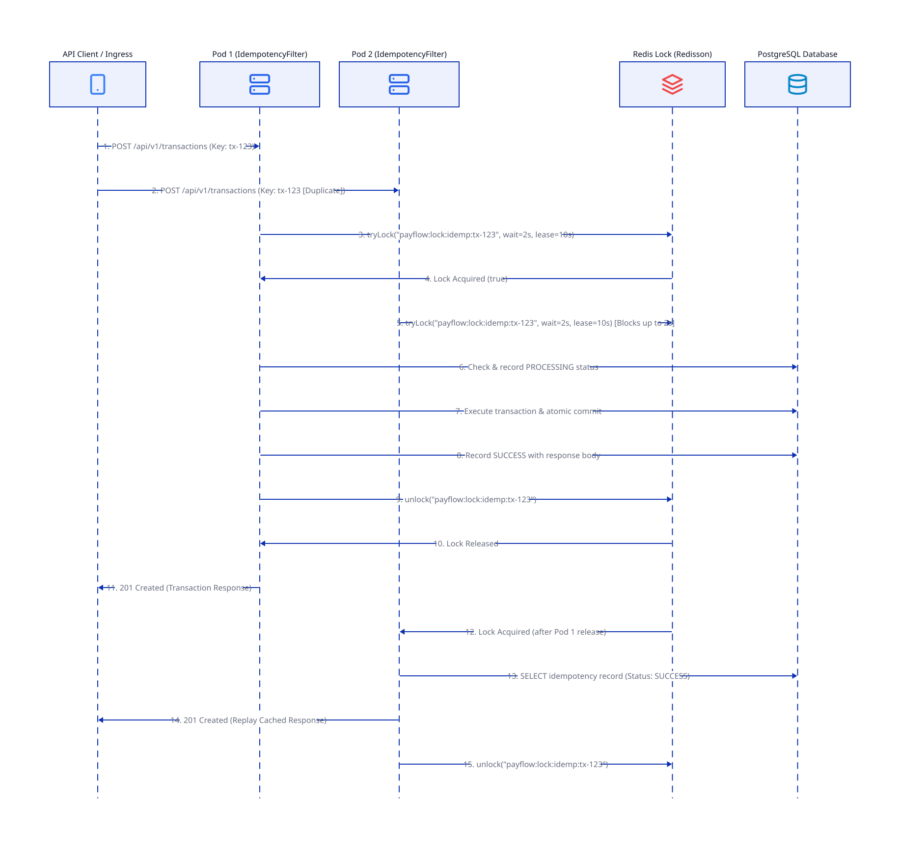

<details>
<summary>📐 View Declarative D2 Diagram Source</summary>

```d2
shape: sequence_diagram

client: API Client / Ingress {
  icon: "docs/assets/icons/client.svg"
}
pod1: Pod 1 (IdempotencyFilter) {
  icon: "docs/assets/icons/server.svg"
}
pod2: Pod 2 (IdempotencyFilter) {
  icon: "docs/assets/icons/server.svg"
}
redis: Redis Lock (Redisson) {
  icon: "docs/assets/icons/redis.svg"
}
db: PostgreSQL Database {
  icon: "docs/assets/icons/postgresql.svg"
}

client -> pod1: "1. POST /api/v1/transactions (Key: tx-123)"
client -> pod2: "2. POST /api/v1/transactions (Key: tx-123 [Duplicate])"

pod1 -> redis: "3. tryLock(\"payflow:lock:idemp:tx-123\", wait=2s, lease=10s)"
redis -> pod1: "4. Lock Acquired (true)"
pod2 -> redis: "5. tryLock(\"payflow:lock:idemp:tx-123\", wait=2s, lease=10s) [Blocks up to 2s]"

pod1 -> db: "6. Check & record PROCESSING status"
pod1 -> db: "7. Execute transaction & atomic commit"
pod1 -> db: "8. Record SUCCESS with response body"
pod1 -> redis: "9. unlock(\"payflow:lock:idemp:tx-123\")"
redis -> pod1: "10. Lock Released"
pod1 -> client: "11. 201 Created (Transaction Response)"

redis -> pod2: "12. Lock Acquired (after Pod 1 release)"
pod2 -> db: "13. SELECT idempotency record (Status: SUCCESS)"
pod2 -> client: "14. 201 Created (Replay Cached Response)"
pod2 -> redis: "15. unlock(\"payflow:lock:idemp:tx-123\")"
```
</details>

#### Key Design Characteristics:

1. **Profile-Conditional Architecture**:
   - **`prod` Profile**: Activates `RedissonDistributedLockService` backed by `RedissonClient` using `SingleServerConfig` (connection pool: 20, idle: 5, timeout: 3000ms).
   - **`!prod` Profiles (`local`, `test`, `prod-light`)**: Activates `NoOpDistributedLockService`, delivering zero-dependency instant local startup without requiring a Redis daemon.
2. **Bounded Wait Time (`LOCK_WAIT_TIME = 2s`)**:
   Instead of immediately rejecting duplicate requests with a 409 Conflict, the second request waits up to 2 seconds for the first request to finish, enabling seamless cached response replay.

3. **Fail-Safe Automatic Lease (`LOCK_LEASE_TIME = 10s`)**:
   Guarantees that if a pod crashes or is terminated (`SIGKILL`) during execution, the lock automatically expires in Redis after 10 seconds, preventing permanent distributed deadlocks.

4. **Thread-Ownership Verification (`isHeldByCurrentThread()`)**:
   Before executing `unlock()`, the service confirms that the current thread owns the lock. This prevents `IllegalMonitorStateException` hazards if the lease expired during an unusually slow downstream call.

5. **Defensive Slice Test Fallback**:
   In slice tests (`@WebMvcTest`) where service beans are not scanned, `IdempotencyFilter` falls back gracefully to `new NoOpDistributedLockService()`, eliminating test configuration boilerplate.

### C. Append-Only Double-Entry Balance Ledger

All financial balance operations execute double-entry bookkeeping by persisting two immutable `BalanceLedgerEntry` records (`DEBIT` for sender, `CREDIT` for receiver) within the same `@Transactional` database boundary as the money transfer:

- **Audit Integrity**: Every ledger entry records `amount`, `balanceBefore`, and `balanceAfter`, providing an immutable audit trail for every user balance state transition.
- **Balance Reconciliation**: `users.balance` functions as a high-performance denormalized field. The authoritative source of truth can be validated at any time by executing a reconciliation query over the `balance_ledger` table:
  ```sql
  SELECT COALESCE(SUM(CASE WHEN entry_type = 'CREDIT' THEN amount ELSE -amount END), 0)
  FROM balance_ledger WHERE user_id = :userId;
  ```

- **Immutability**: Once written, ledger rows are never updated or deleted. Reversals or refunds append new `CREDIT`/`DEBIT` ledger rows.

### D. Database Indexing Strategy

To ensure high database read throughput and statement generation speed, the following index constraints are established in Flyway migrations:

- `CREATE UNIQUE INDEX idx_users_upi_id ON users(upi_id);`
- `CREATE UNIQUE INDEX idx_users_reference_id ON users(reference_id);`
- `CREATE INDEX idx_tx_sender_created ON transactions(sender_upi_id, created_at DESC);`
- `CREATE INDEX idx_tx_receiver_created ON transactions(receiver_upi_id, created_at DESC);`
- `CREATE INDEX idx_tx_reference_id ON transactions(reference_id);`
- `CREATE INDEX idx_ledger_user_created ON balance_ledger(user_id, created_at DESC);`

### E. Flyway Versioned Database Migrations

All database DDL changes execute via Flyway versioned SQL scripts located in `src/main/resources/db/migration/`:

- `V1__create_users_table.sql`: Baseline schema for `users` table.
- `V2__create_transactions_table.sql`: Schema for `transactions` table with foreign keys to `users`.
- `V3__create_balance_ledger_table.sql`: Schema for `balance_ledger` double-entry audit table.
- `V4__add_performance_indexes.sql`: Composite and unique indexes for UPI lookups, transaction queries, and ledger audit lookups.

Hibernate is configured to `spring.jpa.hibernate.ddl-auto=validate`, forcing JPA mapping validation against Flyway-managed schema while prohibiting unversioned database mutations in production.

### F. Spring Environment Profiles & Testcontainers Strategy

Configuration is structured cleanly across profile-specific YAML files:

| Profile | Datasource / DB Engine | Flyway | JPA DDL Auto | Primary Purpose |
| :--- | :--- | :--- | :--- | :--- |
| **`local`** | H2 In-Memory (`MODE=PostgreSQL`) | Enabled | `validate` | Instant local dev startup without Docker |
| **`test`** | Testcontainers PostgreSQL (`postgres:16-alpine`) | Enabled | `validate` | 100% production-parity integration testing |
| **`prod`** | External PostgreSQL Cluster | Enabled | `validate` | Production deployment with HikariCP tuning & graceful shutdown |

Integration tests extend `AbstractIntegrationTest`, utilizing `@Testcontainers(disabledWithoutDocker = true)` and `@DynamicPropertySource` to dynamically spin up disposable PostgreSQL containers and bind JDBC credentials, ensuring full schema migration and locking verification against real PostgreSQL.

### G. Comprehensive Multi-Tier Testing Strategy (Pyramid Architecture)

Payflow enforces a multi-tier testing strategy following the standard Test Pyramid:

```
                  / \
                 / IT\        <- Testcontainers PostgreSQL Integration Tests (Phase 4B/5B)
                /-----\
               / Slice \      <- WebMvc (@WebMvcTest) & DataJPA (@DataJpaTest) Slice Tests (Phase 5A)
              /---------\
             / Unit Tests\    <- Mockito Service & MapStruct Mapper Unit Tests (Phase 5A)
            /-------------\
```

1. **Service Unit Tests (Mockito)**: Focus on business domain isolation (`UserServiceTest`, `TransactionServiceTest`). Services are tested with mocked repositories, verifying lock acquisition ordering, balance invariance, domain exception handling, and double-entry ledger creation.
2. **WebMvc Controller Slice Tests (`@WebMvcTest`)**: Focus on HTTP interface contract verification (`UserControllerTest`, `TransactionControllerTest`). Test DTO validation (`422 Unprocessable Entity`), RFC 7807 problem detail error responses, HTTP status codes (`201 Created`, `404 Not Found`), and pagination parameter enforcement.
3. **Data JPA Repository Slice Tests (`@DataJpaTest`)**: Focus on SQL query compilation and repository correctness (`UserRepositoryTest`, `BalanceLedgerRepositoryTest`). Verify custom JPQL/SQL aggregate queries (e.g., balance reconciliation `SUM` queries) and pessimistic lock query execution (`SELECT FOR UPDATE`).
4. **MapStruct Mapper Unit Tests**: Verify zero-loss mapping between JPA entities and public DTO records (`UserMapperTest`, `TransactionMapperTest`, `LedgerMapperTest`).
5. **Concurrency & Integration Tests (Testcontainers PostgreSQL)**: Focus on full-stack integration and high-concurrency race condition testing against real PostgreSQL containers (`TransferLifecycleIT`, `ConcurrentTransferIT`, `MutualTransferDeadlockIT`):
   - **Concurrency Testing (`CountDownLatch`)**: Validates double-spend prevention under simultaneous withdrawal requests. 10 synchronized worker threads attempt to withdraw ₹100 from an account with ₹150 balance at the exact same millisecond. Tests assert that exactly 1 succeeds, 9 fail with `InsufficientBalanceException`, and the final balance is ₹50 (never negative).
   - **Deadlock Avoidance Verification**: Simulates simultaneous mutual cross-transfers ($A \rightarrow B$ and $B \rightarrow A$), proving that deterministic alphabetical lock ordering by UPI ID prevents circular wait deadlocks.
   - **Double-Entry Ledger Reconciliation**: Verifies that aggregate JPQL queries ($\sum\text{CREDIT} - \sum\text{DEBIT}$) across the `balance_ledger` table match `users.balance` at all times.

---

## 4. JPA N+1 Query Resolution

When loading transaction histories (e.g., querying users and their related list of transactions), Hibernate's default lazy loading triggers the **N+1 query problem**:

- 1 query is executed to fetch the page of $N$ users.
- $N$ queries are executed to fetch the transactions for each individual user.

### Resolution Strategy

To maintain a high-performance database connection pool, Payflow resolves this using `@EntityGraph` annotations in Spring Data JPA repositories:
```java
// In TransactionRepository.java
@EntityGraph(attributePaths = {"sender", "receiver"})
Optional<Transaction> findByReferenceId(UUID referenceId);

@EntityGraph(attributePaths = {"sender", "receiver"})
Page<Transaction> findBySenderUpiIdOrReceiverUpiId(String senderUpiId, String receiverUpiId, Pageable pageable);
```

This forces Spring Data JPA to generate a single SQL query with `LEFT OUTER JOIN`s, retrieving the transaction along with its associated `sender` and `receiver` `User` entities in a single database round-trip.

---

## 5. API Versioning Strategy

To support continuous releases and backward compatibility for mobile and third-party integrations, the project enforces **URI-based API versioning**:

- **Format**: `/api/v1/...` (e.g., `POST /api/v1/transactions`).
- **Implementation**: Controllers are explicitly mapped under versioned path prefixes:
  ```java
  @RestController
  @RequestMapping("/api/v1/transactions")
  public class TransactionController { ... }
  ```

- **Deprecation Policy**: Old version routes (e.g., `/api/v1`) remain active until deprecated by major versions (`/api/v2`), routing traffic transparently via the API Gateway.

---

## 6. Durable Idempotency Engine

To guarantee "exactly-once" execution on payment mutations, Payflow enforces a durable, database-backed idempotency filter that requires clients to pass a unique `Idempotency-Key` header with write requests.

### Idempotency Schema

```sql
CREATE TABLE idempotency_registry (
    idempotency_key VARCHAR(255) PRIMARY KEY,
    request_hash VARCHAR(64) NOT NULL,
    status VARCHAR(50) NOT NULL, -- INITIATED, PROCESSING, SUCCESS, FAILED
    response_body TEXT,
    response_code INT,
    created_at TIMESTAMP WITH TIME ZONE DEFAULT CURRENT_TIMESTAMP,
    updated_at TIMESTAMP WITH TIME ZONE DEFAULT CURRENT_TIMESTAMP
);

CREATE INDEX idx_idemp_created ON idempotency_registry(created_at);
```

### Idempotency Filter Lifecycle Flow

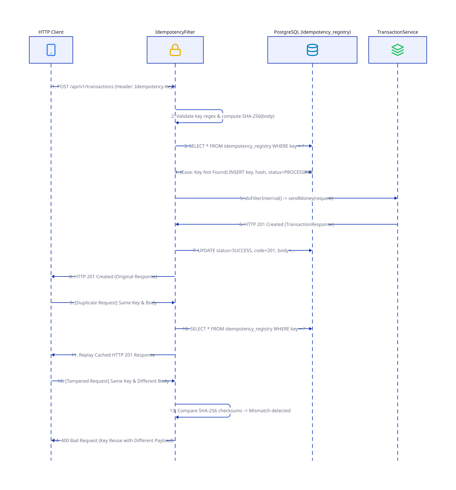

<details>
<summary>📐 View Declarative D2 Diagram Source</summary>

```d2
shape: sequence_diagram

client: HTTP Client {
  icon: "docs/assets/icons/client.svg"
}
filter: IdempotencyFilter {
  icon: "docs/assets/icons/lock.svg"
}
db: PostgreSQL (idempotency_registry) {
  icon: "docs/assets/icons/postgresql.svg"
}
service: TransactionService {
  icon: "docs/assets/icons/spring.svg"
}

client -> filter: "1. POST /api/v1/transactions (Header: Idempotency-Key)"
filter -> filter: "2. Validate key regex & compute SHA-256(body)"
filter -> db: "3. SELECT * FROM idempotency_registry WHERE key = ?"

filter -> db: "4. (Case: Key Not Found) INSERT key, hash, status=PROCESSING"
filter -> service: "5. doFilterInternal() -> sendMoney(request)"
service -> filter: "6. HTTP 201 Created (TransactionResponse)"
filter -> db: "7. UPDATE status=SUCCESS, code=201, body=..."
filter -> client: "8. HTTP 201 Created (Original Response)"

client -> filter: "9. [Duplicate Request] Same Key & Body"
filter -> db: "10. SELECT * FROM idempotency_registry WHERE key = ?"
filter -> client: "11. Replay Cached HTTP 201 Response"

client -> filter: "12. [Tampered Request] Same Key & Different Body"
filter -> filter: "13. Compare SHA-256 checksums -> Mismatch detected"
filter -> client: "14. 400 Bad Request (Key Reuse with Different Payload)"
```
</details>

### In-Flight Lease Recovery & Distributed Race Handling

- **Crashed Worker Node Recovery**: If an application node crashes mid-flight while a transaction is in status `PROCESSING`, the in-flight lease automatically expires after 2 minutes (`IN_FLIGHT_TIMEOUT`), allowing client retries to re-acquire the lock without waiting for the 24-hour TTL purge.
- **Concurrent Insert Collision Safety**: If two concurrent requests with the same key arrive simultaneously and both pass initial existence checks, database unique constraint enforcement triggers a `DataIntegrityViolationException`, which the filter catches and gracefully translates to `409 Conflict`.

### Background TTL Purge Service

A scheduled job (`IdempotencyCleanupService`) executes periodically (`payflow.idempotency.cleanup-cron`) to purge expired records older than the configured TTL (`payflow.idempotency.ttl-hours`, default 24 hours). The `idx_idemp_created` B-Tree index ensures constant-time range scan performance during deletion.

---

## 7. Spring Modulith Event Publication & Transactional Outbox

To achieve reliable event-driven messaging, Payflow uses **Spring Modulith's Event Publication Registry** (`spring-modulith-starter-jpa`) to atomically persist domain events within the same database transaction as the business state change. This eliminates the dual-write problem without requiring custom outbox polling infrastructure.

### Event Publication Schema

```sql
CREATE TABLE IF NOT EXISTS event_publication (
    id UUID NOT NULL,
    listener_id VARCHAR(512) NOT NULL,
    event_type VARCHAR(512) NOT NULL,
    serialized_event TEXT NOT NULL,
    publication_date TIMESTAMP WITH TIME ZONE NOT NULL,
    completion_date TIMESTAMP WITH TIME ZONE,
    PRIMARY KEY (id)
);

CREATE INDEX IF NOT EXISTS idx_event_pub_completion ON event_publication(completion_date);
CREATE INDEX IF NOT EXISTS idx_event_pub_date ON event_publication(publication_date);
```

### Transactional Outbox Flow

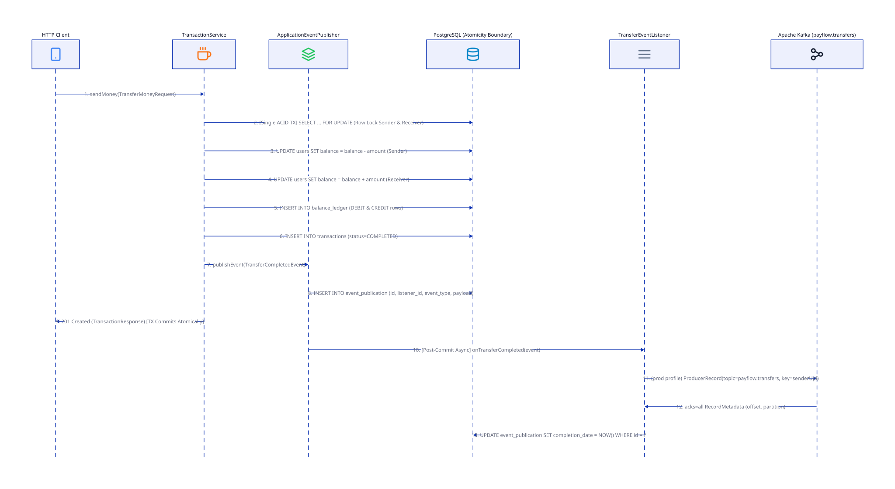

<details>
<summary>📐 View Declarative D2 Diagram Source</summary>

```d2
shape: sequence_diagram

client: HTTP Client {
  icon: "docs/assets/icons/client.svg"
}
service: TransactionService {
  icon: "docs/assets/icons/java.svg"
}
publisher: ApplicationEventPublisher {
  icon: "docs/assets/icons/spring.svg"
}
db: PostgreSQL (Atomicity Boundary) {
  icon: "docs/assets/icons/postgresql.svg"
}
listener: TransferEventListener {
  icon: "docs/assets/icons/queue.svg"
}
kafka: Apache Kafka (payflow.transfers) {
  icon: "docs/assets/icons/kafka.svg"
}

client -> service: "1. sendMoney(TransferMoneyRequest)"
service -> db: "2. [Single ACID TX] SELECT ... FOR UPDATE (Row Lock Sender & Receiver)"
service -> db: "3. UPDATE users SET balance = balance - amount (Sender)"
service -> db: "4. UPDATE users SET balance = balance + amount (Receiver)"
service -> db: "5. INSERT INTO balance_ledger (DEBIT & CREDIT rows)"
service -> db: "6. INSERT INTO transactions (status=COMPLETED)"
service -> publisher: "7. publishEvent(TransferCompletedEvent)"
publisher -> db: "8. INSERT INTO event_publication (id, listener_id, event_type, payload)"
service -> client: "9. 201 Created (TransactionResponse) [TX Commits Atomically]"

publisher -> listener: "10. [Post-Commit Async] onTransferCompleted(event)"
listener -> kafka: "11. (prod profile) ProducerRecord(topic=payflow.transfers, key=senderUpi)"
kafka -> listener: "12. acks=all RecordMetadata (offset, partition)"
listener -> db: "13. UPDATE event_publication SET completion_date = NOW() WHERE id = ?"
```
</details>

### Module Boundary Verification

Spring Modulith continuously validates domain encapsulation and architectural coupling rules across packages via `ModulithStructureTest`:
```java
ApplicationModules modules = ApplicationModules.of(PayflowApiApplication.class);
modules.verify();
```

### Evolutionary Architecture Path

| Stage | Profile | Event Handling | Kafka Required? | Status |
| :--- | :--- | :--- | :--- | :--- |
| **Phase 6B** | `local` / `test` | In-process `@ApplicationModuleListener` | No | ✅ Complete |
| **Phase 9A** | `prod` / `kafka` | Auto-externalized to Kafka (`payflow.transfers`, key: `senderUpi`) via `spring-modulith-events-kafka` | Yes | ✅ Complete |
| **Phase 10B** | `prod-light` | In-process (no Kafka, Caffeine caching, bounded Hikari pool) | No | ✅ Complete |

### Kafka Event Externalization Topology (Phase 9A)

When running under the `prod` profile (or the `kafka` test/dev profile via `application-kafka.yml`), Spring Modulith automatically binds the transactional outbox registry to Apache Kafka:

1. **Topic & Replication**: Created via `NewTopic` using property `${payflow.kafka.transfers-topic:payflow.transfers}` with 3 partitions. Replication factor is configurable via `${payflow.kafka.topic-replicas}` (defaults to `3` in `application-prod.yml` for multi-broker cluster durability, and `1` in `application-kafka.yml` for single-broker dev/test containers).
2. **Dynamic Programmatic Routing**: Configured via `EventExternalizationConfiguration`, dynamically binding `@Externalized` `TransferCompletedEvent` to the exact same topic property, ensuring topic creation and event externalization never diverge.
3. **Partitioning Key**: `senderUpi` (e.g. `aarav@payflow`), ensuring all transfer events originating from the same sender arrive strictly in order at the same partition for consumer groups.
4. **Delivery Guarantees (At-Least-Once Outbox Handshake)**:
   - **Producer Retry Idempotence**: `acks=all` with `enable.idempotence=true` deduplicates in-flight network retries within an active producer session.
   - **At-Least-Once End-to-End Delivery**: The transactional outbox pattern guarantees that committed transactions are reliably delivered to Kafka. However, if a process terminates after Kafka acknowledges receipt but before Spring Modulith updates `event_publication.completion_date` in PostgreSQL, the record remains pending and will be republished upon restart. Downstream consumer services must enforce idempotency by deduplicating against the unique transaction `referenceId`.
5. **Zero Domain Intrusion**: Core domain services (`TransactionService.sendMoney()`) require zero messaging dependencies; Spring Modulith intercepts published domain events post-commit and routes them to Kafka.

This design ensures that domain service code (`TransactionService.sendMoney()`) **never changes** regardless of whether events are consumed in-process or streamed to Kafka. The Spring Modulith framework handles the routing transparently based on active Spring profiles.

---

## 8. Spring Security & Stateless JWT Authentication

Payflow secures all financial and private user endpoints using **Spring Security 6/7** and **Stateless JSON Web Tokens (JWT)**. Authentication is completely decoupled from server session state, allowing frictionless horizontal scaling across distributed cloud nodes.

### Authentication & Token Issuance Flow

1. **User Login (`POST /api/v1/auth/login`)**: The client provides their registered `upiId`. Upon successful user lookup, `JwtTokenProvider` generates a cryptographically signed HMAC-SHA256 token containing user claims (`sub: upiId`, `referenceId`, `roles: [ROLE_USER]`, `iat`, `exp`).
2. **Access Token Lifetime**: Configured to 1 hour (3600s) via `payflow.security.jwt.expiration-ms`.
3. **Public vs Protected Route Matrix**:
   - **Public**: `POST /api/v1/auth/login`, `POST /api/v1/users` (onboarding), `/swagger-ui/**`, `/v3/api-docs/**`, `/actuator/health/**`, `/actuator/info`.
   - **Protected**: `POST /api/v1/transactions`, `GET /api/v1/transactions/**`, `GET /api/v1/users/**` (all require `Authorization: Bearer <token>`).

### Security Filter Chain Sequence

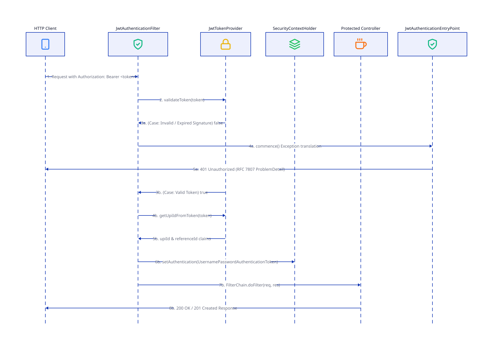

<details>
<summary>📐 View Declarative D2 Diagram Source</summary>

```d2
shape: sequence_diagram

client: HTTP Client {
  icon: "docs/assets/icons/client.svg"
}
filter: JwtAuthenticationFilter {
  icon: "docs/assets/icons/shield.svg"
}
provider: JwtTokenProvider {
  icon: "docs/assets/icons/lock.svg"
}
context: SecurityContextHolder {
  icon: "docs/assets/icons/spring.svg"
}
controller: Protected Controller {
  icon: "docs/assets/icons/java.svg"
}
entrypoint: JwtAuthenticationEntryPoint {
  icon: "docs/assets/icons/shield.svg"
}

client -> filter: "1. Request with Authorization: Bearer <token>"
filter -> provider: "2. validateToken(token)"

provider -> filter: "3a. (Case: Invalid / Expired Signature) false"
filter -> entrypoint: "4a. commence() Exception translation"
entrypoint -> client: "5a. 401 Unauthorized (RFC 7807 ProblemDetail)"

provider -> filter: "3b. (Case: Valid Token) true"
filter -> provider: "4b. getUpiIdFromToken(token)"
provider -> filter: "5b. upiId & referenceId claims"
filter -> context: "6b. setAuthentication(UsernamePasswordAuthenticationToken)"
filter -> controller: "7b. FilterChain.doFilter(req, res)"
controller -> client: "8b. 200 OK / 201 Created Response"
```
</details>

### Principal-Bound Resource Authorization & Sender Verification (Phase 7B)

While JWT authentication verifies the client's cryptographic identity, **Principal-Bound Authorization** enforces resource-level permissions and sender verification across all endpoints:

1. **Strict Sender Verification (`POST /api/v1/transactions`)**:
   - `TransactionService.sendMoney()` extracts the authenticated UPI handle via `SecurityUtils.getAuthenticatedUpiId()`.
   - Asserts that `authenticatedUpi.equalsIgnoreCase(request.getSenderUpiId())`.
   - Any attempt by user $A$ to initiate a transfer debited from user $B$'s account is immediately rejected with `403 Forbidden` (`ForbiddenOperationException`) **before** acquiring database row locks or mutating balances.

2. **Multi-Party Transaction Visibility (`GET /api/v1/transactions/{id}`)**:
   - Only the **sender** or the **receiver** participating in a financial transaction is authorized to retrieve its details.
   - Unrelated third-party users attempting to inspect other transactions receive `403 Forbidden`.

3. **Double-Entry Balance Ledger Privacy (`GET /api/v1/users/{id}/ledger`)**:
   - Users are restricted to retrieving their own double-entry ledger audit entries. Cross-user ledger inspection attempts are rejected with `403 Forbidden`.

4. **Standardized RFC 7807 403 Problem Details**:
   - Filter-level security rejections trigger `JwtAccessDeniedHandler`, emitting `application/problem+json` with `403 Forbidden`.
   - Domain-level authorization violations trigger `GlobalExceptionHandler` mapping `ForbiddenOperationException` to uniform RFC 7807 payloads.

### Declarative HTTP Interface Client & Outbound UPI Validation (Phase 7C)

During user onboarding (`POST /api/v1/users`), Payflow integrates with upstream banking / NPCI verification gateways via **Spring 6.1+ Declarative HTTP Interface Clients** backed by fluent `RestClient`:

1. **Declarative Contract (`@HttpExchange` / `@GetExchange`)**:
   - `UpiValidationClient` defines type-safe contract interfaces with zero boilerplate implementation.
   - Dynamic proxies generated at boot via `HttpServiceProxyFactory` and `RestClientAdapter`.

2. **Outbound Resilience with Exponential Backoff & Jitter**:
   - Outbound HTTP calls use Spring Retry (`@Retryable`) with exponential backoff (`delay = 500ms`, `multiplier = 2.0`, `random = true` jitter) up to 3 attempts to prevent thundering herd storms during downstream gateway blips.

3. **High-Availability Non-Blocking Graceful Fallback**:
   - If the external gateway is persistently unreachable or times out, the `@Recover` handler (`UpiValidationService.recoverFromValidationFailure`) logs a warning and proceeds with registration. External third-party outages never compromise user registration availability.
   - If the external gateway explicitly reports `valid = false`, registration is blocked with `InvalidUpiException` (`422 Unprocessable Entity`).

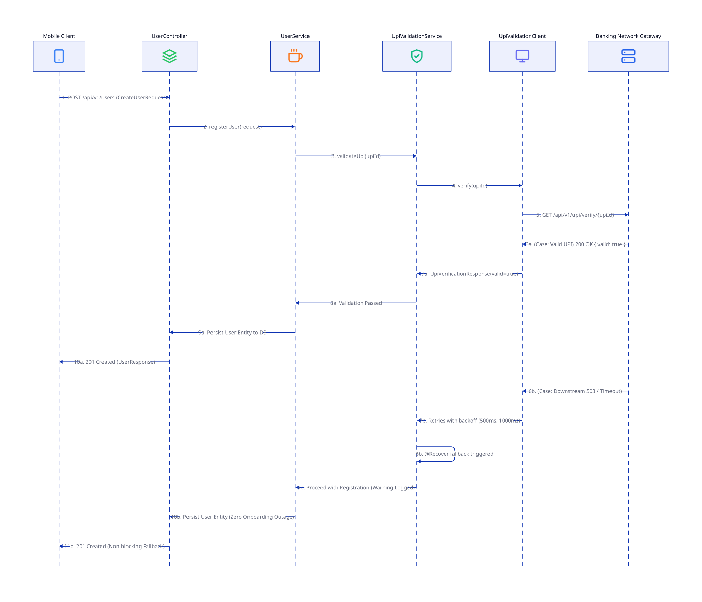

<details>
<summary>📐 View Declarative D2 Diagram Source</summary>

```d2
shape: sequence_diagram

client: Mobile Client {
  icon: "docs/assets/icons/client.svg"
}
controller: UserController {
  icon: "docs/assets/icons/spring.svg"
}
service: UserService {
  icon: "docs/assets/icons/java.svg"
}
validator: UpiValidationService {
  icon: "docs/assets/icons/shield.svg"
}
http_client: UpiValidationClient {
  icon: "docs/assets/icons/gateway.svg"
}
gateway: Banking Network Gateway {
  icon: "docs/assets/icons/server.svg"
}

client -> controller: "1. POST /api/v1/users (CreateUserRequest)"
controller -> service: "2. registerUser(request)"
service -> validator: "3. validateUpi(upiId)"

validator -> http_client: "4. verify(upiId)"
http_client -> gateway: "5. GET /api/v1/upi/verify/{upiId}"

gateway -> http_client: "6a. (Case: Valid UPI) 200 OK { valid: true }"
http_client -> validator: "7a. UpiVerificationResponse(valid=true)"
validator -> service: "8a. Validation Passed"
service -> controller: "9a. Persist User Entity to DB"
controller -> client: "10a. 201 Created (UserResponse)"

gateway -> http_client: "6b. (Case: Downstream 503 / Timeout)"
http_client -> validator: "7b. Retries with backoff (500ms, 1000ms)"
validator -> validator: "8b. @Recover fallback triggered"
validator -> service: "9b. Proceed with Registration (Warning Logged)"
service -> controller: "10b. Persist User Entity (Zero Onboarding Outage)"
controller -> client: "11b. 201 Created (Non-blocking Fallback)"
```
</details>

---

## 9. Gen-AI Spend Insights & Categorization

To support smart financial features, the project includes an **AI spend assistant** integration using **Spring AI** connected to an LLM provider API:

- **AI Categorization**: An asynchronous listener or dedicated endpoint reads transaction metadata and recent `BalanceLedgerEntry` history (amounts, merchant UPI names, transaction notes, DEBIT/CREDIT classifications) and passes a structured prompt to the LLM to map transactions into structured categories (e.g., `Groceries`, `Utilities`, `Entertainment`, `Dining`).
- **Structured JSON Schema**: Prompts leverage the LLM's structured JSON output mode to force the response directly into a predefined JSON schema mapping, preventing formatting errors.
- **Budgeting Insights**: Generates automated personal budgeting recommendations based on the user's double-entry balance ledger audit history via clean prompt engineering and LLM integrations.

---

## 10. Resilience Policies & Thread Tuning

System stability under load is enforced using **Resilience4j** configurations:

* **Rate Limiting**: Enforced at the service layer (`TransactionService.sendMoney()`) via a dynamic per-user Resilience4j RateLimiter aspect (`@PerUserRateLimiter(name = "transferLimiter")`). Limits mutations to 10 req/s per authenticated user (with RFC 6585 `Retry-After: 1`) to prevent denial-of-service attempts, backed by automated background eviction of inactive partitions.
* **Connection & Read Timeouts**: Explicit timeouts configured on the HTTP clients (`UpiValidationClient`) and database connections to prevent thread pool depletion.
* **Retries & Backoff**: Outbound requests (e.g. to third-party banking processors) are wrapped in Spring Retry & Resilience4j Circuit Breaker policies using **exponential backoff with random jitter** to prevent thundering herd requests on recovering downstream hosts.
* **Virtual Threads Integration (Project Loom — Phase 10B)**:
  Java 25 virtual threads are enabled globally (`spring.threads.virtual.enabled=true`). Since virtual threads do not block OS kernel threads during blocking I/O (database transactions, external HTTP REST calls, Redis operations), the application services thousands of concurrent requests with minimal memory overhead (~1 KB per virtual thread vs ~1 MB per platform thread). To prevent relational database connection starvation, HikariCP's maximum pool size is explicitly bounded (`maximum-pool-size=20`, `idle-timeout=300000ms`, `max-lifetime=1800000ms` in `prod`, and `maximum-pool-size=5` in `prod-light`).

* **Gen-AI Fault Tolerance & Heuristic Fallback (Phase 10A)**:
  The Gen-AI Spend Insights engine (`LlmInsightClient`) is protected by a dedicated Resilience4j Circuit Breaker (`aiCircuitBreaker`) and time limiter. When downstream LLM inference encounters timeouts, rate limits, or connectivity failures, the circuit breaker instantly diverts execution to `ruleBasedFallback(Transaction, Throwable)`. This heuristic fallback evaluates recipient handle metadata across 8 expenditure categories, ensuring 100% endpoint uptime and zero disruption to the payment system.

---

## 11. Cloud-Native Containerization & Kubernetes Architecture (Phase 11A, 11B, 11C)

Payflow API adopts an immutable, production-hardened cloud-native deployment model:

### A. Multi-Stage Containerization & Hardening (Phase 11A)

- **Multi-Stage `Dockerfile`**:
  - **Stage 1 (`builder`)**: Utilizes `eclipse-temurin:25-jdk` to resolve Maven dependencies and compile the executable Spring Boot fat JAR, leveraging BuildKit cache mounts (`--mount=type=cache,target=/root/.m2`) to speed up subsequent builds.
  - **Stage 2 (`runtime`)**: Employs minimal `eclipse-temurin:25-jre` to construct a lightweight (~250 MB) production runtime image, eliminating compilers, build dependencies, and package managers from the production artifact.
- **Unprivileged Least-Privilege Execution**: Creates a dedicated non-root user and group (`payflow:10001`) with no login shell; all container filesystem assets are owned by `payflow:10001`, satisfying CIS Docker Benchmark controls.
- **Container Health Probes**: Integrates native Docker `HEALTHCHECK` targeting the Spring Boot Actuator readiness endpoint (`/actuator/health/readiness`).
- **JVM Ergonomics for Containers**: Sets `-XX:+UseZGC -XX:+ZGenerational -XX:MaxRAMPercentage=75.0 -Djava.security.egd=file:/dev/./urandom` to ensure Generational ZGC sub-millisecond pauses while auto-sizing heap allocations to container cgroup memory limits.
- **Full-Stack Docker Compose (`docker-compose.yml`)**: Orchestrates the entire distributed banking topology locally with volume persistence and health dependency ordering (`condition: service_healthy`):
  - **PostgreSQL 17**: `postgres:17-alpine` with `pg_isready` healthcheck and `postgres_data` volume.
  - **Redis 7**: `redis:7-alpine` with `redis-cli ping` healthcheck and `redis_data` volume.
  - **Apache Kafka 3.9 (KRaft)**: `apache/kafka:latest` running controller/broker combined KRaft mode (no Zookeeper required) with persistent `kafka_data` volume.
  - **Ollama Gen-AI**: `ollama/ollama:latest` for offline LLM spend categorization with `ollama_data` volume.
  - **Prometheus & Grafana**: Automatically provisions Prometheus scraping (`monitoring/prometheus/prometheus.yml`) and Grafana datasources/dashboards (`monitoring/grafana/provisioning/dashboards/payflow.json`).

### B. Kubernetes Deployment Topology & Elasticity (Phase 11B)

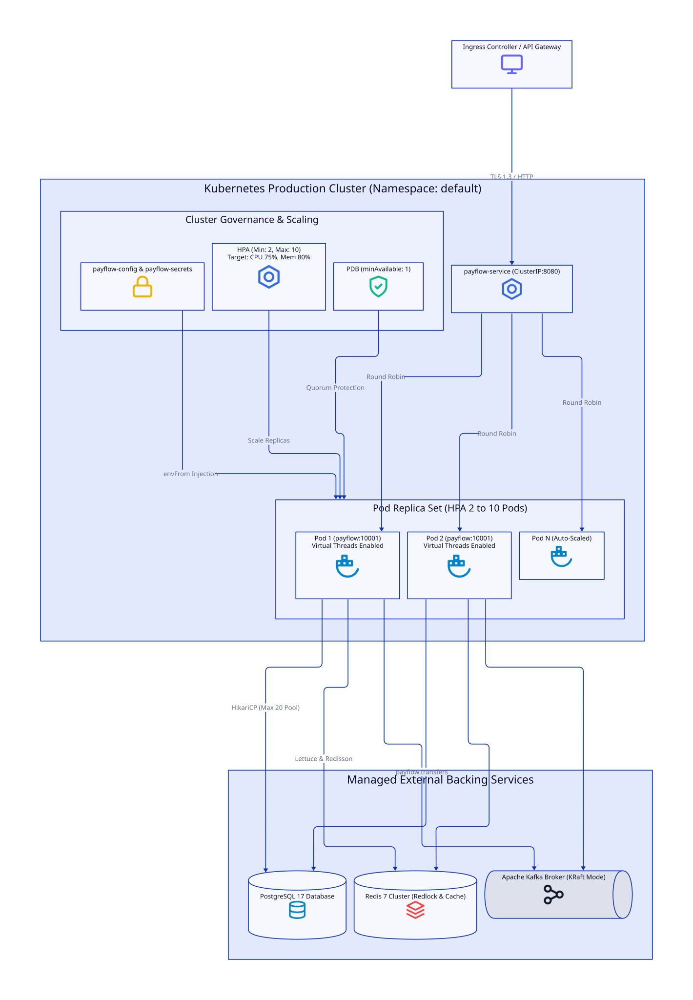

<details>
<summary>📐 View Declarative D2 Diagram Source</summary>

```d2
direction: down

ingress: Ingress Controller / API Gateway {
  shape: rectangle
  icon: "docs/assets/icons/gateway.svg"
}

cluster: Kubernetes Production Cluster (Namespace: default) {
  service: payflow-service {
    shape: rectangle
    icon: "docs/assets/icons/kubernetes.svg"
    label: "payflow-service (ClusterIP:8080)"
  }

  workloads: Pod Replica Set (HPA 2 to 10 Pods) {
    pod1: Pod payflow-api-1 {
      shape: rectangle
      icon: "docs/assets/icons/docker.svg"
      label: "Pod 1 (payflow:10001)\nVirtual Threads Enabled"
    }

    pod2: Pod payflow-api-2 {
      shape: rectangle
      icon: "docs/assets/icons/docker.svg"
      label: "Pod 2 (payflow:10001)\nVirtual Threads Enabled"
    }

    podN: Pod payflow-api-N {
      shape: rectangle
      icon: "docs/assets/icons/docker.svg"
      label: "Pod N (Auto-Scaled)"
    }
  }

  controls: Cluster Governance & Scaling {
    hpa: HorizontalPodAutoscaler {
      shape: rectangle
      icon: "docs/assets/icons/kubernetes.svg"
      label: "HPA (Min: 2, Max: 10)\nTarget: CPU 75%, Mem 80%"
    }

    pdb: PodDisruptionBudget {
      shape: rectangle
      icon: "docs/assets/icons/shield.svg"
      label: "PDB (minAvailable: 1)"
    }

    config: ConfigMap & Secrets {
      shape: rectangle
      icon: "docs/assets/icons/lock.svg"
      label: "payflow-config & payflow-secrets"
    }
  }

  service -> workloads.pod1: "Round Robin"
  service -> workloads.pod2: "Round Robin"
  service -> workloads.podN: "Round Robin"

  controls.hpa -> workloads: "Scale Replicas"
  controls.pdb -> workloads: "Quorum Protection"
  controls.config -> workloads: "envFrom Injection"
}

ingress -> cluster.service: "TLS 1.3 / HTTP"

backing: Managed External Backing Services {
  postgres: PostgreSQL 17 {
    shape: cylinder
    icon: "docs/assets/icons/postgresql.svg"
    label: "PostgreSQL 17 Database"
  }

  redis: Redis 7 Cluster {
    shape: cylinder
    icon: "docs/assets/icons/redis.svg"
    label: "Redis 7 Cluster (Redlock & Cache)"
  }

  kafka: Apache Kafka (KRaft) {
    shape: queue
    icon: "docs/assets/icons/kafka.svg"
    label: "Apache Kafka Broker (KRaft Mode)"
  }
}

cluster.workloads.pod1 -> backing.postgres: "HikariCP (Max 20 Pool)"
cluster.workloads.pod1 -> backing.redis: "Lettuce & Redisson"
cluster.workloads.pod1 -> backing.kafka: "payflow.transfers"

cluster.workloads.pod2 -> backing.postgres
cluster.workloads.pod2 -> backing.redis
cluster.workloads.pod2 -> backing.kafka
```
</details>

- **Manifest Suite (`k8s/`)**:
  - `deployment.yaml`: Configured with zero-downtime rolling updates (`maxSurge: 1`, `maxUnavailable: 0`), non-root security context (`runAsNonRoot: true`, `runAsUser: 10001`), resource requests (`250m` CPU, `512Mi` RAM) and limits (`1000m` CPU, `1024Mi` RAM).
  - `service.yaml`: Internal `ClusterIP` exposing port 8080 targeting port 8080.
  - `configmap.yaml` & `secret.yaml`: Strict declarative separation of environment variables from cryptographic credentials.
  - `hpa.yaml`: HorizontalPodAutoscaler automatically scales between 2 and 10 replicas based on 75% CPU and 80% memory utilization thresholds.
  - `pdb.yaml`: PodDisruptionBudget guarantees at least 1 pod remains continuously available (`minAvailable: 1`) during cluster upgrades or node draining.

### C. Coordinated Graceful Shutdown Lifecycle

In distributed Kubernetes environments, terminating pods requires coordinated draining to prevent dropping active financial transactions:

1. **Endpoint Deregistration**: Kubernetes removes the terminating pod from service endpoint slices asynchronously.
2. **Pre-Stop Hook**: The pod spec executes a `lifecycle.preStop` hook running `sleep 10`. This delay allows kube-proxy and Ingress controllers to propagate endpoint removal before the container receives a termination signal.
3. **Graceful Application Draining**:
   - `server.shutdown: graceful`: Embedded Tomcat ceases accepting new connections.
   - `spring.lifecycle.timeout-per-shutdown-phase: 30s`: Spring allows active HTTP transactions, database queries, and Kafka event externalizations up to 30 seconds to complete cleanly before JVM termination.

### D. Automated CI/CD Quality Gates & Bytecode Analysis (Phase 11C)

- **SpotBugs Static Analysis (`spotbugs-maven-plugin:4.10.4.1`)**: Executes static bytecode verification during the Maven `verify` phase with `effort: Max` and `threshold: Medium`. Filtered by `spotbugs-exclude.xml` for generated MapStruct mappers and compatibility stubs; achieved **0 bugs and 0 errors**.
- **JaCoCo Coverage Enforcement (`jacoco-maven-plugin:0.8.15`)**: Automatically enforces strict bundle-level code coverage limits:
  - **Line Coverage**: Minimum 80% (Achieved: **90%** across 191 tests).
  - **Branch Coverage**: Minimum 70% (Achieved: **73%** across 191 tests).
  - Pure DTOs, configuration classes, entities, and generated MapStruct classes are excluded from coverage calculations.
- **GitHub Actions Workflow Hardening**: `.github/workflows/ci.yml` executes `mvn clean verify -B`, failing fast on formatting, checkstyle, test failures, SpotBugs warnings, or coverage violations, while uploading JaCoCo and SpotBugs report artifacts for 14-day retention and deploying the Material for MkDocs documentation portal (`https://shashankch.github.io/payflow-api/`) with D2 diagrams, coverage quality gates (`https://shashankch.github.io/payflow-api/coverage/`), and live interactive JaCoCo coverage reports (`https://shashankch.github.io/payflow-api/coverage-report/`) to GitHub Pages.

---

## 12. Observability Stack (Phase 8A)

Payflow implements the **Three Pillars of Observability** — Metrics, Tracing, and Logging — using industry-standard open-source tooling and Spring Boot 4 / Micrometer Observation architecture:

### A. Distributed Tracing (OpenTelemetry & Micrometer Observation)

- **Micrometer Tracing** with the **OpenTelemetry bridge** (`micrometer-tracing-bridge-otel` and `opentelemetry-exporter-otlp`) automatically generates and propagates W3C-standard `traceparent` headers (`traceId`, `spanId`) across HTTP controllers, database queries, and async thread pools.
- **Method-Level Spans**: Domain service operations like `TransactionService.sendMoney()` are instrumented with `@Observed(name = "payflow.transfers.send", contextualName = "send-money-transfer")` via `ObservedAspect`, creating dedicated trace spans and execution timers automatically.
- **Header Correlation**: The client-provided or auto-generated `X-Request-Id` (via `RequestIdFilter`) coexists with W3C `traceparent` context, returning both headers in HTTP responses.
- Compatible with **Grafana Tempo**, **Jaeger**, or any OTLP-compatible tracing backend.

### B. Business & System Metrics (Prometheus + Grafana)

- **Business Metrics (`MetricsConfig.java`)**:
  - `payflow.transfers.total`: Counter tagged by transfer status (`COMPLETED`, `FAILED`, `INSUFFICIENT_BALANCE`, `FORBIDDEN`).
  - `payflow.transfers.amount`: Distribution summary with SLA percentiles (p50, p95, p99) tracking transfer monetary distribution in Indian Rupees (INR, ₹).
  - `payflow.transfers.duration`: Timer with SLA percentiles (p50, p95, p99) tracking end-to-end transfer execution latency.
- **System & Pool Metrics**: Actuator exposes HikariCP connection pool saturation (`PayflowHikariPool`), JVM memory, garbage collection, and thread states.
- **Prometheus Scraping**: Prometheus scrapes `/actuator/prometheus` without authentication barriers (`SecurityConfig` permits actuator metric endpoints).

### C. Structured Logging & MDC Enrichment (`RequestLoggingFilter.java`)

- **MDC Correlation**: `RequestIdFilter` and `RequestLoggingFilter` populate MDC keys across every request:
  - `requestId`: Unique request identifier (`X-Request-Id`).
  - `traceId` and `spanId`: OpenTelemetry trace context.
  - `http.status`, `http.method`, `http.uri`, `http.latency_ms`: HTTP execution telemetry.
- **Environment Profiles**:
  - `prod` profile: Activates native structured JSON logging (`logging.structured.format.console: ecs`) for ingestion by Elasticsearch, Grafana Loki, or CloudWatch.
  - `local` / `test` profiles: Outputs formatted ANSI colored logs:
    ```text
    2026-08-27 20:30:45.123 [http-nio-8080-exec-1] [req-abc-123] [4bf92f3577b34da6a3ce929d0e0e4736,00f067aa0ba902b7] INFO  c.p.f.RequestLoggingFilter - HTTP POST /api/v1/transactions - 201 (18ms)
    ```

---

## 13. Resilience Architecture & Fault Tolerance (Phase 8B)

Payflow API incorporates **Resilience4j** to safeguard system stability under peak traffic spikes, noisy neighbor conditions, and downstream service degradations.

### A. Resilience Policy Configuration Matrix

| Policy | Component | Target | Key Configuration Parameters | Failure Behavior |
| :--- | :--- | :--- | :--- | :--- |
| **Rate Limiter** | `transferLimiter` | `TransactionService.sendMoney()` | `limitForPeriod: 10`, `limitRefreshPeriod: 1s`, `timeoutDuration: 0s` | Returns HTTP `429 Too Many Requests` with `Retry-After: 1` |
| **Circuit Breaker** | `upiValidation` | `UpiValidationService` | `COUNT_BASED`, sliding window `10`, min calls `5`, failure threshold `50%`, wait in open `5s`, half-open calls `3` | Trips to `OPEN`; returns HTTP `503 Service Unavailable` or executes graceful fallback |
| **Time Limiter** | `upiValidation` | Outbound HTTP calls | `timeoutDuration: 5s`, `cancelRunningFuture: true` | Terminates slow hanging requests, preventing thread starvation |
| **Transaction Timeout** | Database Engine | Balance debit/credit & ledger write | `timeout = 5s` (Spring `@Transactional`) | Aborts deadlock-prone or hung SQL transactions |

### B. Dynamic Per-User Rate Limiting Pattern

Unlike traditional global rate limiting, which allows a single abusive script to exhaust server throughput for all customers, Payflow enforces **per-authenticated-user partition isolation**:

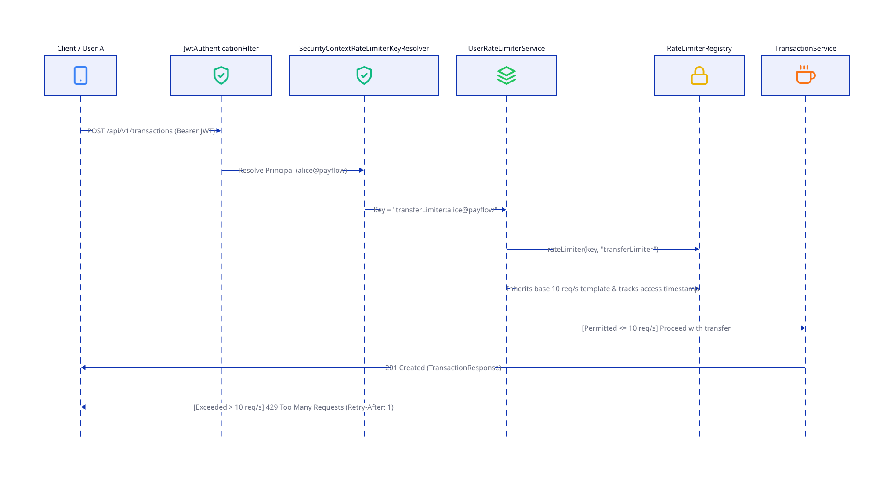

<details>
<summary>📐 View Declarative D2 Diagram Source</summary>

```d2
shape: sequence_diagram

client: Client / User A {
  icon: "docs/assets/icons/client.svg"
}
filter: JwtAuthenticationFilter {
  icon: "docs/assets/icons/shield.svg"
}
resolver: SecurityContextRateLimiterKeyResolver {
  icon: "docs/assets/icons/shield.svg"
}
service: UserRateLimiterService {
  icon: "docs/assets/icons/spring.svg"
}
reg: RateLimiterRegistry {
  icon: "docs/assets/icons/lock.svg"
}
core: TransactionService {
  icon: "docs/assets/icons/java.svg"
}

client -> filter: "POST /api/v1/transactions (Bearer JWT)"
filter -> resolver: "Resolve Principal (alice@payflow)"
resolver -> service: "Key = \"transferLimiter:alice@payflow\""
service -> reg: "rateLimiter(key, \"transferLimiter\")"
service -> reg: "Inherits base 10 req/s template & tracks access timestamp" {
  style.stroke-dash: 3
}
service -> core: "[Permitted <= 10 req/s] Proceed with transfer"
core -> client: "201 Created (TransactionResponse)"
service -> client: "[Exceeded > 10 req/s] 429 Too Many Requests (Retry-After: 1)"
```
</details>

- **Memory Eviction Safeguard**: Dynamically generated rate limiter instances are tracked by access timestamp. `UserRateLimiterService.evictInactiveLimiters()` executes periodically, purging partitions inactive for >15 minutes from the registry to prevent unbounded memory growth.

### C. Downstream Circuit Breaking & Selective Exception Filtering

The external UPI verification gateway is guarded by a Resilience4j Circuit Breaker:

- **Count-Based Sliding Window**: Measures the outcome of the last 10 calls. Once 5 calls are completed, if >=50% fail with network exceptions (`RestClientException`, `IOException`), the circuit trips to `OPEN`.
- **Selective Exception Filtering**: Client data errors (such as `InvalidUpiException` mapped to HTTP 422) are domain validation rejections and explicitly excluded via `ignoreExceptions`, ensuring bad user inputs do not falsely trip downstream infrastructure breakers.
- **Fail-Fast & Recovery**: In `OPEN` state, downstream calls fail fast without network traversal. After 5 seconds, the circuit transitions to `HALF_OPEN`, testing 3 probe requests to automatically heal back to `CLOSED`.

### D. Resilience Metrics & Actuator Integration

- **Prometheus Gauges & Counters**:
  - `resilience4j.circuitbreaker.state`: Current state (`closed`, `open`, `half_open`).
  - `resilience4j.circuitbreaker.calls`: Total calls tagged by `kind` (`successful`, `failed`, `ignored`).
  - `resilience4j.ratelimiter.available_permissions`: Current remaining quota per partition.
  - `resilience4j.ratelimiter.waiting_threads`: Threads blocked waiting for permits.
- **Health Indicators**: Exposed under `/actuator/health` with `circuitBreakers` and `rateLimiters` component statuses.

---

## 14. Distributed Caching Architecture & Cache-Aside Pattern (Phase 8C)

To achieve sub-10ms response latencies on repetitive user profile lookups and balance ledger inspection while shielding PostgreSQL from read connection exhaustion, Payflow API implements a **Profile-Conditional Cache-Aside Architecture** using Spring Cache, Redis (Lettuce), and Caffeine.

### A. Cache-Aside Workflow & Sequence Diagram

In the Cache-Aside pattern, the application service inspects the cache before accessing the underlying database. On write operations, the cache entries are evicted rather than updated inline, eliminating race conditions between concurrent database writes and cache updates.

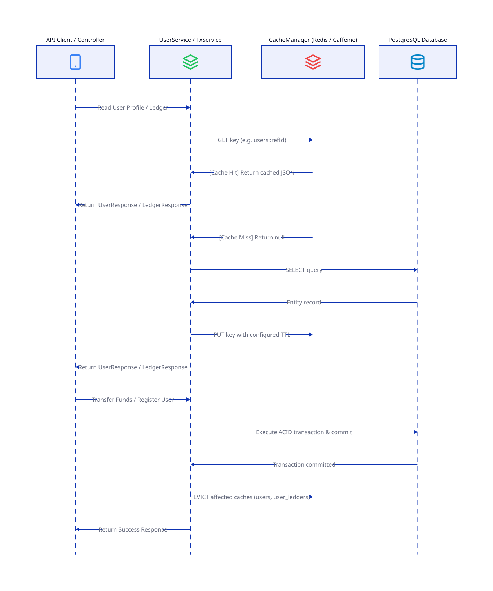

<details>
<summary>📐 View Declarative D2 Diagram Source</summary>

```d2
shape: sequence_diagram

client: API Client / Controller {
  icon: "docs/assets/icons/client.svg"
}
service: UserService / TxService {
  icon: "docs/assets/icons/spring.svg"
}
cache: CacheManager (Redis / Caffeine) {
  icon: "docs/assets/icons/redis.svg"
}
db: PostgreSQL Database {
  icon: "docs/assets/icons/postgresql.svg"
}

client -> service: "Read User Profile / Ledger"
service -> cache: "GET key (e.g. users::refId)"

cache -> service: "[Cache Hit] Return cached JSON"
service -> client: "Return UserResponse / LedgerResponse"

cache -> service: "[Cache Miss] Return null"
service -> db: "SELECT query"
db -> service: "Entity record"
service -> cache: "PUT key with configured TTL"
service -> client: "Return UserResponse / LedgerResponse"

client -> service: "Transfer Funds / Register User"
service -> db: "Execute ACID transaction & commit"
db -> service: "Transaction committed"
service -> cache: "EVICT affected caches (users, user_ledgers)"
service -> client: "Return Success Response"
```
</details>

### B. Profile-Conditional Cache Strategy

The cache infrastructure adapts transparently across environments via `CacheConfig.java`:

| Environment / Profile | Cache Provider | Implementation Class | Characteristics & Configuration |
| :--- | :--- | :--- | :--- |
| **`prod`** | **Redis (Lettuce)** | `RedisCacheManager` | Centralized distributed cache across multi-pod deployments. Configured via `LettuceConnectionFactory` with standalone host/port. Serialization uses `RedisSerializer.string()` for keys and `RedisSerializer.json()` for values. |
| **`!prod` (`local`, `test`, `prod-light`)** | **Caffeine** | `CaffeineCacheManager` | High-performance in-memory cache requiring zero external network dependencies or Docker containers. Spec: `maximumSize=1000,expireAfterWrite=600s`. |

### C. Cache Names, Key Schemes & TTL Matrix

Cache policies are externalized in `application.yml` and tuned based on data volatility and freshness requirements:

| Cache Name | Cached Methods | Key Scheme | TTL | Eviction Triggers |
| :--- | :--- | :--- | :--- | :--- |
| `users` | `getUserById()`, `getUserByReferenceId()`, `findByUpiId()`, `getUserByUpiId()` | `#id`, `#referenceId`, `#upiId` (single method arg) | **10 minutes** (`600s`) | Targeted eviction on `sendMoney()` (sender & receiver keys only) and `registerUser()` |
| `user_ledgers` | `getUserLedger()` | `#userReferenceId + '_' + #pageable.pageNumber` | **1 minute** (`60s`) | Targeted eviction on `sendMoney()` (sender & receiver keys only) |

### D. Serialization & Entity Hardening

1. **Modern JSON Serialization (`RedisSerializer.json()`)**:
   Spring Data Redis 3.x / Spring Framework 7 deprecates `GenericJackson2JsonRedisSerializer`. Payflow leverages `RedisSerializer.json()` for non-intrusive, polymorphic JSON value encoding. This avoids native Java binary serialization vulnerabilities while ensuring human-readable inspectability in Redis CLI (`redis-cli`).

2. **Null-Safety Handling**:
   Read operations use `@Cacheable(..., unless = "#result == null")`. When a service method returns `Optional<User>`, Spring's caching aspect unwraps the `Optional` before SpEL condition evaluation. The `#result == null` guard ensures empty optionals are not cached, preventing false positive hits for non-existent users.

3. **Circular Reference & Proxy Isolation**:
   Domain entities are hardened for JSON serialization:

   - `User` and `BalanceLedgerEntry` implement `java.io.Serializable` (`serialVersionUID = 1L`).
   - `BalanceLedgerEntry` is decorated with `@JsonIgnoreProperties({"hibernateLazyInitializer", "handler"})` to prevent Jackson serialization failures on uninitialized Hibernate bytecode proxies.
   - Lazy JPA relationships (`user`, `transaction`) in `BalanceLedgerEntry` are annotated with `@JsonIgnore` to eliminate circular reference graphs during JSON marshaling.

### E. Targeted Cache Invalidation Mechanics (Phase 9B)

Prior to Phase 9B, `TransactionService.sendMoney()` utilized blanket cache invalidation (`@CacheEvict(value = {"users", "user_ledgers"}, allEntries = true)`). In production, this created a **Cache Stampede (Thundering Herd)** vulnerability, purging all cached active sessions across the entire application whenever any two users completed a transfer.

In Phase 9B, Payflow API replaced blanket eviction with programmatic **Targeted Eviction** (`evictTargetedCaches`):

1. **Scope Bounded**: Only the transaction's `sender` and `receiver` keys are invalidated.
2. **Multi-Key Invalidation**: Selectively evicts each participant's primary lookup keys:
   - `users` cache: `upiId`, `referenceId`, and internal `userId`.
   - `user_ledgers` cache: `referenceId` and common initial page keys (`refId + '_0'`).
3. **Preserved Working Set**: All cached user records and ledger entries for unrelated customers (e.g. `charlie@payflow`) remain in Redis/Caffeine memory, preserving high cache hit ratios under high transfer concurrency.

---

## 15. Testing Strategy (Rigor, Concurrency & Unit Verification)

To ensure maximum code coverage and high system reliability, the project defines a two-tier testing strategy consisting of isolated unit tests and full-stack integration tests.

### A. Isolated Unit Testing Strategy

Unit tests focus on isolating individual components and verifying business logic without booting the database or messaging middleware:

1. **Controller Layer (MockMVC)**:
   - Evaluates HTTP serialization, URL routing, request DTO validation constraints (e.g. invalid UPI patterns, blank fields), and custom error mapping to RFC 7807 payloads.
   - Tested using Spring's `@WebMvcTest` paired with `@MockitoBean` (standard in Spring Boot 4.1.x) to stub the service layers, ensuring lightning-fast execution.
2. **Service Layer (Mockito)**:
   - Validates business rules, balance invariant checking, and custom exceptions throwing (e.g., `UserNotFoundException` or `InsufficientBalanceException`).
   - Uses Mockito annotations (`@ExtendWith(MockitoExtension.class)`) to isolate business service operations from Spring lifecycle overhead.
3. **Repository Layer (DataJpaTest)**:
   - Confirms that custom derived queries or complex JPQL Fetch Joins compile and execute successfully.
   - Executed via `@DataJpaTest` running against an embedded H2 database instance.
4. **Mocking External Services**:
   - Outbound REST endpoints (UPI validation via HTTP Interface Client), the AI model assistant API, and Kafka brokers are mocked or stubbed during unit verification using WireMock and MockRestServiceServer to prevent flaky test execution and external network dependence.

### B. Advanced Integration Testing (Rigor & Concurrency Verification)

Integration tests verify the full lifecycle of a transaction across actual container dependencies using **Testcontainers** to orchestrate PostgreSQL and Kafka instances during Maven build phases:

1. **Concurrent Race Condition Testing**:
   - To verify pessimistic row lock deadlocks and double-spend safety under high traffic contention:
     - Initialize an `ExecutorService` with a thread pool (size: 10) and a `CountDownLatch` set to 10.
     - Fire 10 concurrent threads at the same millisecond to withdraw ₹100 from a sender account holding ₹150.
     - **Assertion**: Only 1 transaction commits successfully, 9 threads fail with validation or locking errors, and the final account balance is exactly ₹50.
2. **Idempotency Key Lock Contention Testing**:
   - To verify that gateway-level locks block dual-processing on duplicate submissions:
     - Spin up two concurrent threads executing a transaction using the same `Idempotency-Key` and request payload.
     - **Assertion**: Thread 1 succeeds; Thread 2 is immediately rejected with a `409 Conflict` (custom `IdempotentRequestProcessingException`) without starting any database transaction, proving the gateway Redis lock isolated the duplicate execution path.
3. **Spring Modulith Event Publication Testing**:
   - Confirms domain events published via `ApplicationEventPublisher` are atomically persisted to the event publication log and consumed by `@ApplicationModuleListener` handlers.
   - **Assertion**: Execute a transfer, verify `TransferCompletedEvent` appears in the event publication table within the same database transaction. Verify Kafka externalization (prod profile) via Testcontainers Kafka consumer.

---

## 16. Entity Model & Rich Domain Architecture

To establish robust domain boundaries and prevent corrupt data state, the entity layer adheres to Rich Domain Model principles and precise database constraints:

### A. Financial Precision (`BigDecimal`)

All monetary columns (`balance`, `amount`) are represented using `BigDecimal` mapped to database column definition `@Column(precision = 19, scale = 4, nullable = false)`. Floating-point binary arithmetic primitives (`double`, `float`) are prohibited to eliminate representation error accumulation.

### B. Rich Domain Invariants

Entities encapsulate their own business invariants and state transitions:

- **`User.debit(BigDecimal amount)`**: Enforces positive debit amounts and verifies balance adequacy (`balance >= amount`). Throws `IllegalStateException` or domain exceptions if invariants fail.
- **`User.credit(BigDecimal amount)`**: Enforces positive credit amounts and updates account balance atomically in-memory.

### C. Auditability & Optimistic Locking

- **Audit Timestamps**: `@CreationTimestamp Instant createdAt` and `@UpdateTimestamp Instant updatedAt` automatically track record creation and updates.
- **Optimistic Locking**: `@Version Long version` enables Hibernate to prevent lost updates during concurrent non-locking state updates.

### D. Relational Foreign Key Integrity

The `Transaction` entity maintains explicit JPA `@ManyToOne(fetch = FetchType.LAZY)` foreign key relationships to `User` for `sender` and `receiver`, while retaining denormalized `senderUpiId` and `receiverUpiId` fields for index-optimized queries.

---

## 17. External Service Integration (RestClient & HTTP Interface Client)

Payflow validates UPI IDs against an external validation service during user registration using modern Spring outbound HTTP communication patterns:

### A. RestClient (Spring Framework 7)

`RestClient` is the modern synchronous HTTP client that replaces the deprecated `RestTemplate`. It provides a fluent, immutable API with built-in error handling and serialization support.

### B. HTTP Interface Client

Payflow defines outbound API contracts as declarative Java interfaces using `@GetExchange` / `@PostExchange` annotations:

```java
public interface UpiValidationClient {
    @GetExchange("/verify/{upiId}")
    UpiVerificationResponse verify(@PathVariable String upiId);
}
```

Spring generates the implementation proxy backed by `RestClient` at runtime — conceptually similar to OpenFeign but fully Spring-native with zero external dependencies.

### C. Resilience (Framework 7 Native @Retryable)

Outbound HTTP calls are wrapped with Framework 7's native `@Retryable` annotation (now part of `spring-core`) providing exponential backoff with jitter:

```
Attempt 1 → timeout → wait 500ms
Attempt 2 → timeout → wait ~1000ms (with jitter)
Attempt 3 → success or fallback
```

Graceful fallback: if the UPI validation service is unavailable, registration proceeds with a warning log — external service failures never block core user onboarding.

### D. HTTP Client Comparison Matrix

| Client | Era | Model | Use Case |
| :--- | :--- | :--- | :--- |
| `RestTemplate` | Spring 3 (deprecated in FW7) | Imperative, verbose | Legacy codebases |
| `RestClient` | Spring 6.1+ | Fluent, synchronous | Modern blocking apps |
| `WebClient` | Spring 5+ | Reactive, non-blocking | Reactive pipelines / streaming |
| HTTP Interface Client | Spring 6+ (enhanced in FW7) | Declarative proxy | Clean API contracts, replaces Feign |
| OpenFeign | Spring Cloud | Declarative proxy (external lib) | Legacy Cloud-native apps |

---

## 18. Security Architecture and Threat Model

Payflow API is engineered from the ground up with a **Zero-Trust** and **Defense-in-Depth** security philosophy. Because the system handles monetary transactions and immutable ledger balances, security controls are enforced across every tier of the request lifecycle:

### A. Zero-Trust Request Lifecycle & Filter Chain

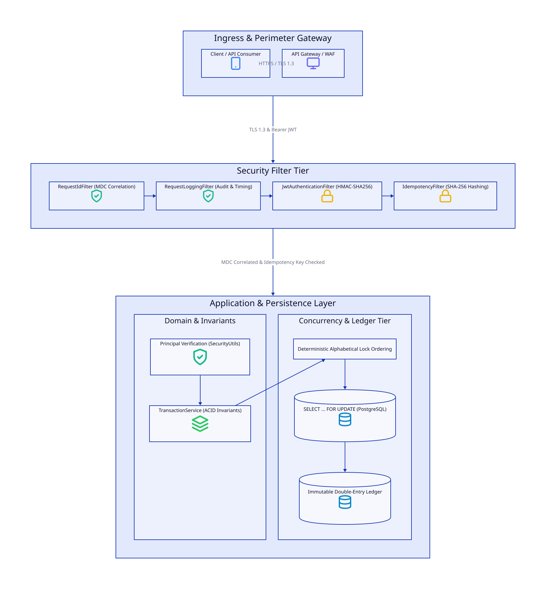

<details>
<summary>📐 View Declarative D2 Diagram Source</summary>

```d2
direction: down

ingress: Ingress & Perimeter Gateway {
  grid-columns: 2

  client: Client / API Consumer {
    shape: rectangle
    icon: "docs/assets/icons/client.svg"
  }
  waf: API Gateway / WAF {
    shape: rectangle
    icon: "docs/assets/icons/gateway.svg"
  }
  client -> waf: "HTTPS / TLS 1.3"
}

filters: Security Filter Tier {
  grid-columns: 4
  
  req_id: RequestIdFilter (MDC Correlation) {
    shape: rectangle
    icon: "docs/assets/icons/shield.svg"
  }
  rl: RequestLoggingFilter (Audit & Timing) {
    shape: rectangle
    icon: "docs/assets/icons/shield.svg"
  }
  jwt: JwtAuthenticationFilter (HMAC-SHA256) {
    shape: rectangle
    icon: "docs/assets/icons/lock.svg"
  }
  idemp: IdempotencyFilter (SHA-256 Hashing) {
    shape: rectangle
    icon: "docs/assets/icons/lock.svg"
  }

  req_id -> rl -> jwt -> idemp
}

app_persistence: Application & Persistence Layer {
  grid-columns: 2

  domain: Domain & Invariants {
    auth: Principal Verification (SecurityUtils) {
      shape: rectangle
      icon: "docs/assets/icons/shield.svg"
    }
    tx: TransactionService (ACID Invariants) {
      shape: rectangle
      icon: "docs/assets/icons/spring.svg"
    }
    auth -> tx
  }

  data: Concurrency & Ledger Tier {
    ordering: Deterministic Alphabetical Lock Ordering {
      shape: rectangle
    }
    pessimistic: SELECT ... FOR UPDATE (PostgreSQL) {
      shape: cylinder
      icon: "docs/assets/icons/postgresql.svg"
    }
    ledger: Immutable Double-Entry Ledger {
      shape: cylinder
      icon: "docs/assets/icons/postgresql.svg"
    }
    ordering -> pessimistic -> ledger
  }

  domain.tx -> data.ordering
}

ingress -> filters: "TLS 1.3 & Bearer JWT"
filters -> app_persistence: "MDC Correlated & Idempotency Key Checked"
```
</details>

### B. Threat Model (STRIDE Analysis)

The system attack surface has been systematically modeled against the **STRIDE** methodology for financial transaction backends:

| Threat Category | Threat Description | Attack Vector | Payflow Mitigation Strategy | Architectural Reference |
| :--- | :--- | :--- | :--- | :--- |
| **Spoofing** | Forged user identity or sender impersonation | Submitting a transfer using another user's UPI handle | Stateless HMAC-SHA256 JWT tokens; `TransactionService` verifies authenticated principal matches `senderUpiId`. | [ADR-0017](adr/0017-stateless-jwt-authentication-and-spring-security-architecture.md), [ADR-0018](adr/0018-principal-bound-resource-access-control-and-sender-verification.md) |
| **Tampering** | Modifying transfer amounts, recipients, or ledger records | Man-in-the-middle payload tampering or key reuse with altered body | SHA-256 raw request byte hashing in `IdempotencyFilter`; immutable append-only `balance_ledger`; TLS 1.3 transport. | [ADR-0012](adr/0012-double-entry-balance-ledger-as-immutable-audit-trail.md), [ADR-0015](adr/0015-sha-256-request-payload-hashing-and-durable-idempotency-engine.md) |
| **Repudiation** | Denying a completed money transfer occurred | Claiming a transaction was executed without authorization or never recorded | Immutable double-entry balance ledger documenting `balanceBefore`, `balanceAfter`, and `amount`; correlation tracking via `X-Request-Id` and OpenTelemetry `traceId`. | [ADR-0012](adr/0012-double-entry-balance-ledger-as-immutable-audit-trail.md), [ADR-0020](adr/0020-structured-logging-prometheus-metrics-and-opentelemetry-observability.md) |
| **Information Disclosure** | Scraping user profiles or observing total transaction volume | Sequential auto-increment ID scanning (`/users/1`, `/users/2`) | Non-enumerable UUID v4 `referenceId` for all public REST APIs; RFC 7807 sanitized error responses; PII redaction in logs. | [ADR-0006](adr/0006-rfc-7807-problemdetail-and-centralized-exception-handling.md), [ADR-0007](adr/0007-uuid-reference-ids-over-auto-increment-primary-keys.md) |
| **Denial of Service (DoS)** | Exhausting database locks, high-frequency request floods, or external dependency cascade failures | Flooding transfer API or hammering hanging downstream UPI validation service | Dynamic per-user rate limiting (10 req/s, RFC 6585 `Retry-After: 1`); external circuit breaking (`upiValidation` 50% threshold, fallback); deterministic alphabetical row locking; `@Transactional(timeout = 5)`; durable idempotency lease locks; bounded HikariCP pool. | [ADR-0010](adr/0010-pessimistic-locking-for-high-concurrency-balance-operations.md), [ADR-0011](adr/0011-deterministic-lock-ordering-for-deadlock-prevention.md), [ADR-0015](adr/0015-sha-256-request-payload-hashing-and-durable-idempotency-engine.md), [ADR-0021](adr/0021-resilience4j-circuit-breaker-per-user-rate-limiting.md), [ADR-0023](adr/0023-redis-distributed-locking-redisson.md) |
| **Elevation of Privilege** | Bypassing authorization to inspect other users' balances | Accessing `/api/v1/users/{id}/ledger` or `/api/v1/transactions/{id}` | Principal-bound authorization; multi-party participant visibility (sender/receiver only); RFC 7807 `403 Forbidden` on unauthorized access. | [ADR-0018](adr/0018-principal-bound-resource-access-control-and-sender-verification.md) |

### C. Identity & Access Management (IAM) & Endpoint Policy Matrix

#### 1. Authentication Architecture

- **Stateless Bearer Tokens**: Authenticated via HMAC-SHA256 (`HS256`) signed JSON Web Tokens (JJWT 0.13.0).
- **Token Claims**: Contains `sub` (UPI handle), `referenceId` (UUID), `roles` (`ROLE_USER`), `iat` (issued at), and `exp` (expiration).
- **Token Expiration**: Strict 1-hour validity window (`3,600,000 ms`) to minimize exposure window if a client token is intercepted.
- **Key Management**: Production deployments inject a 256-bit cryptographically secure secret via environment variable (`PAYFLOW_SECURITY_JWT_SECRET`). `JwtTokenProvider` validates on application startup that the secret is at least 32 characters (256 bits) and is not the default fallback, failing fast with `IllegalStateException` if violated in the `prod` profile.

#### 2. Endpoint Security Matrix

| Endpoint | HTTP Method | Access Policy | Authentication Required | Description |
| :--- | :--- | :--- | :--- | :--- |
| `/api/v1/auth/login` | `POST` | Public | No | Issues stateless JWT bearer token |
| `/api/v1/users` | `POST` | Public | No | Onboards user with external UPI validation |
| `/api/v1/users` | `GET` | Admin-Only | Yes (`ROLE_ADMIN`) | Retrieves paginated user directory |
| `/api/v1/users/balance/{amount}` | `GET` | Admin-Only | Yes (`ROLE_ADMIN`) | Queries users matching minimum balance threshold |
| `/api/v1/users/{id}` | `GET` | Principal-Bound | Yes (`Bearer JWT`) | Retrieves user profile (own profile only) |
| `/api/v1/users/upi/{upiId}` | `GET` | Principal-Bound | Yes (`Bearer JWT`) | Retrieves user profile by UPI (own profile only) |
| `/api/v1/users/{id}/ledger` | `GET` | Principal-Bound | Yes (`Bearer JWT`) | Retrieves user balance ledger entries (own records only) |
| `/api/v1/transactions` | `POST` | Principal-Bound | Yes (`Bearer JWT`) | Executes money transfer (`senderUpiId` must match principal) |
| `/api/v1/transactions/{id}` | `GET` | Multi-Party Bound | Yes (`Bearer JWT`) | Retrieves transaction details (sender or receiver only) |
| `/api/v1/transactions/{id}/insights` | `POST` | Multi-Party Bound | Yes (`Bearer JWT`) | Generates LLM spending insights & categorization (sender or receiver only; Phase 10) |
| `/actuator/health/**` | `GET` | Public | No | Kubernetes liveness and readiness probes |
| `/actuator/info` | `GET` | Public | No | Application build metadata |
| `/actuator/prometheus` | `GET` | Public / Scraping | No | Prometheus telemetry scraping endpoint |
| `/actuator/metrics/**` | `GET` | Public / Scraping | No | Micrometer metric inspection |
| `/swagger-ui/**`, `/v3/api-docs/**` | `GET` | Public | No | OpenAPI 3.0 interactive documentation |

#### 3. Transport, Browser & Framing Security

- **Anti-Clickjacking**: Spring Security enforces `frameOptions().sameOrigin()`, ensuring that console, admin, or API documentation frames cannot be embedded in malicious cross-origin iframes.
- **CORS Hardening**: Cross-Origin Resource Sharing is configured via `payflow.security.cors.allowed-origins`. Credential sharing (`allowCredentials`) is automatically disabled if wildcard origins (`*`) are detected, preventing credential leakage.

### D. Financial State Protection & Concurrency Security

#### 1. Zero Double-Spending Guarantee

To eliminate race conditions and double-spending vulnerabilities during concurrent transfers:

1. Every transfer executes inside a Spring `@Transactional(isolation = Isolation.READ_COMMITTED, timeout = 5)` boundary.
2. User balances are read and locked using **Pessimistic Write Locking** (`SELECT ... FOR UPDATE` via `UserRepository.findUserForUpdateByUpiId()`).
3. Concurrent threads attempting to debit the same sender account block at the database engine until the active transaction commits or aborts.

#### 2. Deadlock Elimination via Deterministic Lock Ordering

When two users concurrently transfer funds to each other (e.g. Aarav sends to Priya while Priya sends to Aarav):

- Acquiring locks in request order causes cyclical wait-for graphs and database deadlocks.
- Payflow resolves this by sorting both UPI IDs lexicographically (`upiA.compareTo(upiB)`) before issuing `SELECT ... FOR UPDATE` queries.
- Both transactions request locks in the exact same sequence (`aarav@payflow` first, then `priya@payflow`), converting cyclical deadlocks into sequential lock queues.

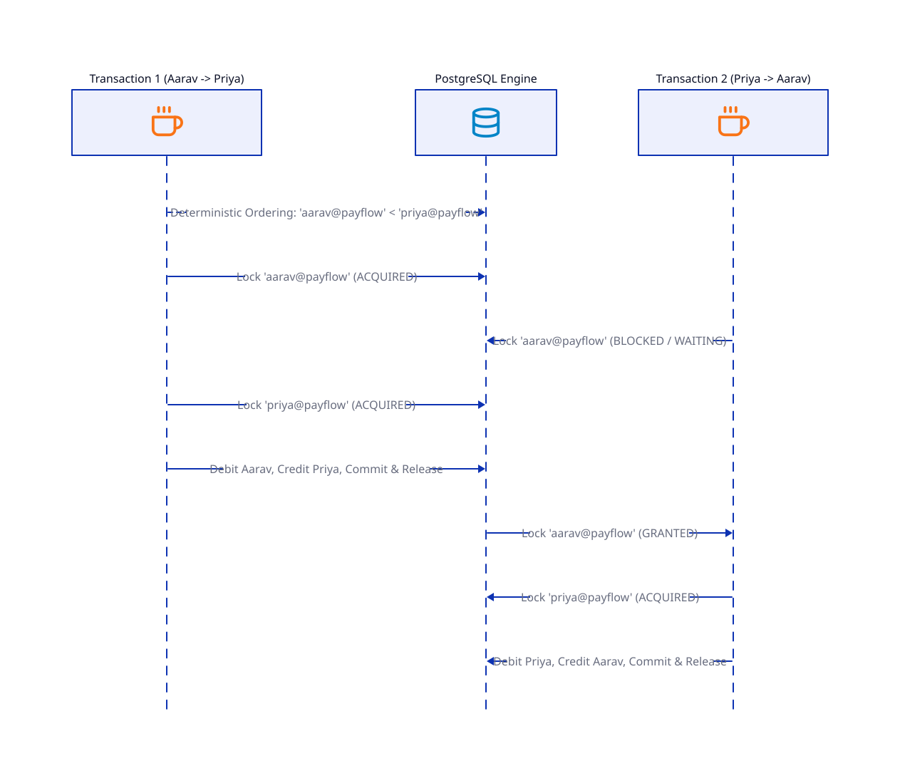

<details>
<summary>📐 View Declarative D2 Diagram Source</summary>

```d2
shape: sequence_diagram

tx1: "Transaction 1 (Aarav -> Priya)" {
  icon: "docs/assets/icons/java.svg"
}
db: "PostgreSQL Engine" {
  icon: "docs/assets/icons/postgresql.svg"
}
tx2: "Transaction 2 (Priya -> Aarav)" {
  icon: "docs/assets/icons/java.svg"
}

tx1 -> db: "Deterministic Ordering: 'aarav@payflow' < 'priya@payflow'" {
  style.stroke-dash: 3
}

tx1 -> db: "Lock 'aarav@payflow' (ACQUIRED)"
tx2 -> db: "Lock 'aarav@payflow' (BLOCKED / WAITING)"
tx1 -> db: "Lock 'priya@payflow' (ACQUIRED)"
tx1 -> db: "Debit Aarav, Credit Priya, Commit & Release"
db -> tx2: "Lock 'aarav@payflow' (GRANTED)"
tx2 -> db: "Lock 'priya@payflow' (ACQUIRED)"
tx2 -> db: "Debit Priya, Credit Aarav, Commit & Release"
```
</details>

#### 3. Financial Base-10 Arithmetic Precision

- All monetary columns (`balance`, `amount`, `balance_before`, `balance_after`) strictly use Java `BigDecimal` denominated in Indian Rupees (INR, ₹) mapped to database column `@Column(precision = 19, scale = 4, nullable = false)`.
- Floating-point types (`double`, `float`) are prohibited across the codebase to prevent IEEE 754 decimal rounding inaccuracies.
- Monetary divisions and conversions explicitly define `RoundingMode.HALF_EVEN` (Banker's Rounding).

### E. Input Validation, Durable Idempotency & Cryptographic Protection

#### 1. Durable Idempotency & Payload Tampering Prevention

1. **Header Requirement & Boundary Validation**: Mutation endpoints require an `Idempotency-Key` HTTP header. Keys must be 1-255 characters conforming to `^[A-Za-z0-9_.:-]+$`, rejecting malformed or oversized keys immediately with `400 Bad Request` before database or lock acquisition.
2. **SHA-256 Request Payload Digest**: The raw HTTP request payload bytes are hashed using SHA-256 (`MessageDigest.getInstance("SHA-256")`).
3. **Tampering Detection**: If a client re-submits an existing `Idempotency-Key` with a different payload (e.g., changed amount or recipient), the engine detects a checksum mismatch and rejects the request with `400 Bad Request` (`Key Reuse`).
4. **Distributed Coordination & Crash Lease Recovery**: In multi-node production deployments, Redisson distributed locks (`payflow:lock:idemp:{key}`) coordinate across pods. In-flight requests lock the key for 2 minutes (`leaseExpiresAt`). If an application node crashes during execution, subsequent retries automatically reclaim the orphaned lease without waiting for the 24-hour purge job.
5. **Cached Response Replay**: Successfully executed transfers replay the cached `201 Created` HTTP response without executing duplicate balance mutations.

#### 2. Input Validation & Injection Mitigation

- **Jakarta Bean Validation (`@Valid`)**: All incoming DTOs enforce strict declarative constraints:
  - `@NotBlank`, `@Size(min = 3, max = 50)`
  - `@Pattern(regexp = "^[a-zA-Z0-9._-]+@[a-zA-Z0-9]+$")` (UPI ID syntax enforcement)
  - `@DecimalMin(value = "0.01")`, `@Digits(integer = 15, fraction = 4)`
- **Spring 6.1+ / 7 Method Validation**: Query and path parameters (`@Min`, `@Max`, `@PathVariable`) are validated by the MVC framework, with `HandlerMethodValidationException` and `MethodArgumentTypeMismatchException` mapped to RFC 9457 `ProblemDetail` (422 and 400).
- **SQL Injection Prevention**: All queries utilize Spring Data JPA parameter binding or explicit JPQL named parameters. Raw string concatenation in SQL queries is prohibited.
- **Cross-Site Scripting (XSS)**: All responses return `application/json` or `application/problem+json`; HTML rendering is disabled in API controllers.

#### 3. Transactional Outbox Lifecycle & Retention Maintenance (Phase 9B)

- **Automated Retention Purge**: Domain events published through Spring Modulith are recorded in the `event_publication` table.
- **Scheduled Maintenance**: `OutboxCleanupService` runs daily at 02:00 AM UTC (`0 0 2 * * *`) via Spring's `@Scheduled` annotation.
- **Spring Modulith 2.0 API**: Calls `CompletedEventPublications.deletePublicationsOlderThan(Duration.ofDays(7))` to cleanly delete completed event records that have aged beyond the 7-day retention period (`payflow.outbox.retention-days`).
- **Fault-Tolerant Execution**: The cleanup service defensively checks for bean presence, catches transient exceptions gracefully, and operates inside a dedicated transaction boundary.

### F. Resilience, Fault Tolerance & DoS Mitigation

#### 1. Dynamic Per-User Rate Limiting

- **Partitioned Rate Limiting**: Implemented via `@PerUserRateLimiter(name = "transferLimiter")` and dynamic Resilience4j registries. Limits are segregated per authenticated user principal (or remote IP for unauthenticated routes).
- **Default Baseline Policy**: 10 requests per second (`limit-for-period = 10`, `limit-refresh-period = 1s`, `timeout-duration = 0ms`).
- **RFC 6585 & RFC 7807 Compliance**: Rejections immediately short-circuit with HTTP `429 Too Many Requests`, an explicit `Retry-After: 1` header, and standardized ProblemDetail payload (`https://api.payflow.com/errors/rate-limit-exceeded`).
- **Memory Leak Protection**: Inactive user limiters are automatically audited and evicted every 15 minutes by `evictInactiveLimiters()`.

#### 2. Circuit Breaker & Cascade Failure Protection

- **External UPI Integration**: Downstream UPI banking network calls via `UpiValidationService` are wrapped in a Resilience4j `@CircuitBreaker(name = "upiValidation")`.
- **Sliding Window Evaluation**: Monitors the last 10 requests (`COUNT_BASED`). If 50% or more fail within a minimum of 5 recorded calls, the circuit opens.
- **Fail-Fast & Fallback**: In the `OPEN` state, requests fail fast with RFC 7807 `503 Service Unavailable` (`https://api.payflow.com/errors/service-unavailable`) without saturating thread pools or hammering downstream systems.
- **Auto-Recovery**: After 5 seconds, the circuit transitions to `HALF_OPEN`, permitting 3 canary probe requests to verify downstream health before closing.

#### 3. Execution Timeouts

- **Strict Time Limits**: External validation and outbound integrations enforce Resilience4j `TimeLimiter` policies (default 5 seconds), preventing connection starvation and pool exhaustion.

### G. Observability, Auditability & Data Privacy

#### 1. Immutable Double-Entry Balance Ledger

- Direct balance updates without ledger entries are forbidden.
- Every completed transfer writes two immutable records to `balance_ledger` (`DEBIT` and `CREDIT`) recording:
  - Account reference (`user_id`, `upi_id`)
  - Entry type (`DEBIT` / `CREDIT`)
  - Transaction reference ID
  - Monetary amount
  - Exact balance before and after execution
- Ledger tables contain no `UPDATE` or `DELETE` triggers; historical state can be audited or reconstructed at any point in time.

#### 2. Sensitive Data Masking, Log Sanitization & Transport Security

- **Credential Masking**: Passwords, raw JWT signatures, and authorization secret keys are excluded from `toString()` representations and log statements.
- **Structured Logging (ECS)**: Production logs output structured JSON adhering to Elastic Common Schema (`logging.structured.format.console: ecs`).
- **MDC Trace Correlation**: Every log statement automatically captures `requestId` (`X-Request-Id`), `traceId`, `spanId`, `http.status`, `http.method`, and `http.latency_ms`.
- **Sanitized Error Responses**: Production error handlers return standard RFC 7807 `ProblemDetail` bodies without exposing raw SQL errors, stack traces, or internal server directory paths.
- **TLS 1.3 Transport Security**: Mandatory for all external gateway ingress traffic.

---

## 19. Alternatives Considered & Trade-off Analysis

Documenting rejected alternatives and evaluating the penalty ("cost of getting it wrong") is critical to preventing architectural regressions.

| Decision Area | Chosen Solution | Alternative Considered | Cost of Getting It Wrong (Penalty) | Why Alternative Was Rejected |
| :--- | :--- | :--- | :--- | :--- |
| **Financial Precision** | `BigDecimal` | `double` / `float` | **Catastrophic**: Cumulative floating-point rounding errors lead to un-reconcilable ledger balances. | Binary floating-point cannot represent base-10 decimals exactly (`0.1 + 0.2 != 0.3`). |
| **Concurrency Control** | Deterministic Pessimistic Locking | Optimistic Locking (`@Version`) | **High**: Under flash-sale high concurrency, optimistic lock collisions cause high transaction abort/retry rates and poor user experience. | Optimistic locking is ideal for read-heavy workloads; money transfers are write-contended on popular seller accounts. |
| **Event Publishing** | Spring Modulith Event Publication Registry | Direct Publish (Service calls Kafka inside `@Transactional`) | **High**: Network failure to Kafka causes rollback of DB transaction or lost events (Dual-write problem). | Direct publishing breaks transactional atomicity between DB state and messaging topics. |
| **Event Publishing** | Spring Modulith Event Publication Registry | Hand-rolled outbox table + `SKIP LOCKED` polling | **Medium**: Custom outbox code requires boilerplate polling dispatcher, manual completion tracking, and retry logic. | Spring Modulith provides framework-managed event persistence, completion callbacks, and transparent Kafka bridging. |
| **API Identification** | Opaque `UUID referenceId` | Exposed `Long userId` | **Medium**: Attackers enumerate total user count and scrape user data via `/api/v1/users/1`, `/2`, `/3`. | Auto-increment IDs leak business metrics and expose predictable resource endpoints. |
| **DTO Serialization** | MapStruct (Compile-time) | Reflection (e.g. `BeanUtils.copyProperties`) | **Medium**: Runtime reflection errors, zero compile-time safety, poor performance under high TPS. | MapStruct generates clean, zero-reflection Java bytecode during Maven build with strict type checking. |
| **Gen-AI Categorization** | Spring AI `ChatClient` + Resilience4j Fallback | Ad-hoc REST Client to LLM | **High**: External LLM downtime or timeouts cascade and break API availability. | Spring AI provides structured record extraction, provider neutrality, and instant sub-second heuristic fallback. |
| **Concurrency Model** | Java 25 Virtual Threads + Bounded HikariCP | Platform Threads with Large Pools | **Medium**: Thread context switching and 1MB stack memory exhaust resources under concurrent blocking I/O. | Virtual threads offer massive concurrency with ~1KB memory overhead while bounded pools prevent DB saturation. |

---

## 20. Open & Resolved Design Issues

### Resolved Design Decisions

- **`RES-001`: MapStruct for DTO Mapping** — Resolved in Phase 2C. Replaced custom manual factories with type-safe MapStruct mappers.
- **`RES-002`: RFC 7807 Error Standard** — Resolved in Phase 2D. Standardized all exception responses on Spring `ProblemDetail`.
- **`RES-003`: User Reference IDs** — Resolved in Phase 2E. Added `UUID referenceId` to `User` entity to insulate API boundaries from auto-increment IDs.
- **`RES-004`: Modular Monolith over Microservices** — Resolved in architecture review. Spring Modulith enforces module boundaries while preserving single-database ACID safety for financial transactions.
- **`RES-005`: OpenTelemetry over Vendor-Specific Tracing** — Resolved in architecture review. Micrometer Tracing + OTel bridge provides portable, W3C-standard distributed tracing.
- **`RES-006`: RestClient + HTTP Interface Client over RestTemplate** — Resolved in architecture review. `RestTemplate` is deprecated in Framework 7; `RestClient` + declarative `@GetExchange`/`@PostExchange` interfaces are the modern standard.
- **`RES-007`: Framework 7 @Retryable + Resilience4j Complementary Use** — Resolved in architecture review. Use spring-core native `@Retryable` for basic outbound HTTP retry; use Resilience4j for advanced patterns (per-user rate limiting, circuit breakers) not yet in spring-core.
- **`RES-008`: Profile-Conditional Cache-Aside (Redis in Prod, Caffeine in Dev/Test)** — Resolved in Phase 8C. Decoupled local development from external Redis while ensuring multi-pod cluster state consistency with JSON value serialization.
- **`RES-009`: Redisson Distributed Locking for Multi-Instance Idempotency Coordination** — Resolved in Phase 8D. Integrated Redisson 4.7.0 distributed locking (`payflow:lock:idemp:{key}`) with fail-safe lease time (10s) and bounded wait time (2s) in `prod`, paired with `NoOpDistributedLockService` fallback in `!prod` (local/test).
- **`RES-010`: Principal Engineer Architecture Audit Remediation & Modern Hardening** — Resolved in Phase 9B. Remediated BOLA on user enumeration endpoints (`ROLE_ADMIN`), enforced production JWT secret entropy verification, eliminated cache stampedes via targeted cache eviction, bound integration tests via `maven-failsafe-plugin`, and automated outbox publication retention via `OutboxCleanupService`.
- **`RES-011`: Gen-AI Spend Categorization with Spring AI and Circuit Breaker Fallback** — Resolved in Phase 10A (ADR-026). Integrated Spring AI 2.0.1 fluent `ChatClient` with structured record conversion, protected by Resilience4j `aiCircuitBreaker` and 8-category rule-based heuristic fallback.
- **`RES-012`: Java 25 Virtual Threads and Bounded HikariCP Connection Pool Optimization** — Resolved in Phase 10B (ADR-027). Enabled `spring.threads.virtual.enabled: true` globally on Java 25, bounded HikariCP pools, and introduced low-memory `prod-light` profile with local Caffeine caching and synchronous Modulith events.

### Open Questions & Future Evaluation

- **`OPEN-001`: Transfer Amount Cap Configuration** — Default cap set to ₹1,00,000 (`100,000.00`). Evaluating whether per-user dynamic velocity caps should be stored in Redis.

