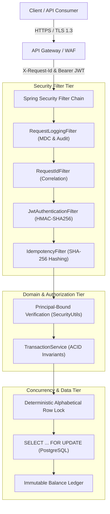
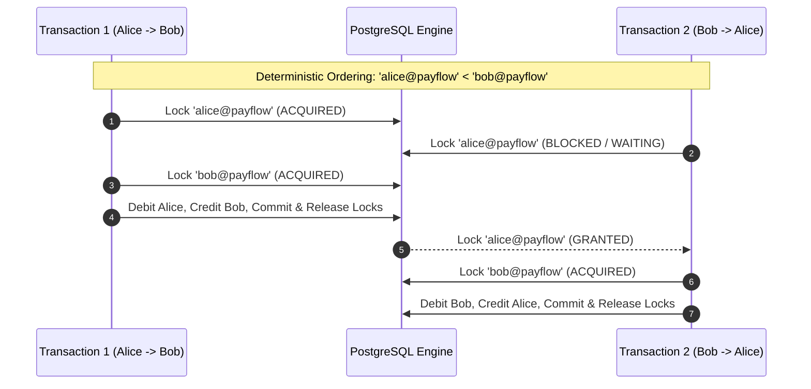

# Payflow API — Security Architecture & Threat Model

> **Enterprise-Grade Financial Security & Compliance Specification**  
> Adhering to OWASP API Security Top 10 (2023), PCI-DSS principles, and Banking-Grade Transaction Integrity.

---

## 1. Security Architecture Overview

Payflow API is engineered from the ground up with a **Zero-Trust** and **Defense-in-Depth** security philosophy. Because the system handles monetary transactions and ledger balances, security controls are enforced across every tier of the request lifecycle:

---

## 2. Threat Model (STRIDE Analysis)

The system's attack surface has been systematically modeled against the **STRIDE** methodology for financial transaction backends:

| Threat Category | Threat Description | Attack Vector | Payflow Mitigation Strategy | Architectural Reference |
| :--- | :--- | :--- | :--- | :--- |
| **Spoofing** | Forged user identity or sender impersonation | Submitting a transfer using another user's UPI handle | Stateless HMAC-SHA256 JWT tokens; `TransactionService` verifies authenticated principal matches `senderUpiId`. | [ADR-017](adr/0017-stateless-jwt-authentication-and-spring-security-architecture.md), [ADR-018](adr/0018-principal-bound-resource-access-control-and-sender-verification.md) |
| **Tampering** | Modifying transfer amounts, recipients, or ledger records | Man-in-the-middle payload tampering or key reuse with altered body | SHA-256 raw request byte hashing in `IdempotencyFilter`; immutable append-only `balance_ledger`; TLS 1.3 transport. | [ADR-012](adr/0012-double-entry-balance-ledger-as-immutable-audit-trail.md), [ADR-015](adr/0015-sha-256-request-payload-hashing-and-durable-idempotency-engine.md) |
| **Repudiation** | Denying a completed money transfer occurred | Claiming a transaction was executed without authorization or never recorded | Immutable double-entry balance ledger documenting `balanceBefore`, `balanceAfter`, and `amount`; correlation tracking via `X-Request-Id` and OpenTelemetry `traceId`. | [ADR-012](adr/0012-double-entry-balance-ledger-as-immutable-audit-trail.md), [ADR-020](adr/0020-structured-logging-prometheus-metrics-and-opentelemetry-observability.md) |
| **Information Disclosure** | Scraping user profiles or observing total transaction volume | Sequential auto-increment ID scanning (`/users/1`, `/users/2`) | Non-enumerable UUID v4 `referenceId` for all public REST APIs; RFC 7807 sanitized error responses; PII redaction in logs. | [ADR-006](adr/006-rfc-7807-problemdetail-and-centralized-exception-handling.md), [ADR-007](adr/0007-uuid-reference-ids-over-auto-increment-primary-keys.md) |
| **Denial of Service (DoS)** | Exhausting database locks or flooding duplicate transfer requests | High-concurrency cross-transfers causing deadlocks or duplicate debits | Deterministic alphabetical row locking; `@Transactional(timeout = 5)`; database-backed idempotency lease locks; bounded HikariCP connection pool. | [ADR-010](adr/0010-pessimistic-locking-for-high-concurrency-balance-operations.md), [ADR-011](adr/0011-deterministic-lock-ordering-for-deadlock-prevention.md), [ADR-015](adr/0015-sha-256-request-payload-hashing-and-durable-idempotency-engine.md) |
| **Elevation of Privilege** | Bypassing authorization to inspect other users' balances | Accessing `/api/v1/users/{id}/ledger` or `/api/v1/transactions/{id}` | Principal-bound authorization; multi-party participant visibility (sender/receiver only); RFC 7807 `403 Forbidden` on unauthorized access. | [ADR-018](adr/0018-principal-bound-resource-access-control-and-sender-verification.md) |

---

## 3. Identity & Access Management (IAM)

### A. Authentication Architecture
- **Stateless Bearer Tokens**: Authenticated via HMAC-SHA256 (`HS256`) signed JSON Web Tokens (JJWT 0.13.0).
- **Token Claims**: Contains `sub` (UPI handle), `referenceId` (UUID), `roles` (`ROLE_USER`), `iat` (issued at), and `exp` (expiration).
- **Token Expiration**: Strict 1-hour validity window (`3,600,000 ms`) to minimize exposure window if a client token is intercepted.
- **Key Management**: Production deployments inject a 256-bit cryptographically secure secret via environment variable (`PAYFLOW_JWT_SECRET`). Hardcoded fallback secrets are prohibited in production profiles.

### B. Endpoint Security Matrix

| Endpoint | HTTP Method | Access Policy | Authentication Required | Description |
| :--- | :--- | :--- | :--- | :--- |
| `/api/v1/auth/login` | `POST` | Public | No | Issues stateless JWT bearer token |
| `/api/v1/users` | `POST` | Public | No | Onboards user with external UPI validation |
| `/api/v1/users/{id}` | `GET` | Principal-Bound | Yes (`Bearer JWT`) | Retrieves user profile (own profile only) |
| `/api/v1/users/upi/{upiId}` | `GET` | Principal-Bound | Yes (`Bearer JWT`) | Retrieves user profile by UPI (own profile only) |
| `/api/v1/users/{id}/ledger` | `GET` | Principal-Bound | Yes (`Bearer JWT`) | Retrieves user balance ledger entries (own records only) |
| `/api/v1/transactions` | `POST` | Principal-Bound | Yes (`Bearer JWT`) | Executes money transfer (`senderUpiId` must match principal) |
| `/api/v1/transactions/{id}` | `GET` | Multi-Party Bound | Yes (`Bearer JWT`) | Retrieves transaction details (sender or receiver only) |
| `/actuator/health/**` | `GET` | Public | No | Kubernetes liveness and readiness probes |
| `/actuator/info` | `GET` | Public | No | Application build metadata |
| `/actuator/prometheus` | `GET` | Public / Scraping | No | Prometheus telemetry scraping endpoint |
| `/actuator/metrics/**` | `GET` | Public / Scraping | No | Micrometer metric inspection |
| `/swagger-ui/**`, `/v3/api-docs/**` | `GET` | Public | No | OpenAPI 3.0 interactive documentation |

---

## 4. Financial State Protection & Concurrency Security

### A. Zero Double-Spending Guarantee
To eliminate race conditions and double-spending vulnerabilities during concurrent transfers:
1. Every transfer executes inside a Spring `@Transactional(isolation = Isolation.READ_COMMITTED, timeout = 5)` boundary.
2. User balances are read and locked using **Pessimistic Write Locking** (`SELECT ... FOR UPDATE` via `UserRepository.findUserForUpdateByUpiId()`).
3. Concurrent threads attempting to debit the same sender account block at the database engine until the active transaction commits or aborts.

### B. Deadlock Elimination via Deterministic Lock Ordering
When two users concurrently transfer funds to each other (e.g. Alice sends to Bob while Bob sends to Alice):
- Acquiring locks in request order causes cyclical wait-for graphs and database deadlocks.
- Payflow resolves this by sorting both UPI IDs lexicographically (`upiA.compareTo(upiB)`) before issuing `SELECT ... FOR UPDATE` queries.
- Both transactions request locks in the exact same sequence (`alice@payflow` first, then `bob@payflow`), converting cyclical deadlocks into sequential lock queues.

### C. Financial Base-10 Arithmetic Precision
- All monetary columns (`balance`, `amount`, `balance_before`, `balance_after`) strictly use Java `BigDecimal` mapped to database column `@Column(precision = 19, scale = 4, nullable = false)`.
- Floating-point types (`double`, `float`) are prohibited across the codebase to prevent IEEE 754 decimal rounding inaccuracies.
- Monetary divisions and conversions explicitly define `RoundingMode.HALF_EVEN` (Banker's Rounding).

---

## 5. Input Validation, Idempotency & Cryptographic Protection

### A. Durable Idempotency & Payload Tampering Prevention
1. **Header Requirement**: Mutation endpoints require an `Idempotency-Key` HTTP header.
2. **SHA-256 Request Payload Digest**: The raw HTTP request payload bytes are hashed using SHA-256 (`MessageDigest.getInstance("SHA-256")`).
3. **Tampering Detection**: If a client re-submits an existing `Idempotency-Key` with a different payload (e.g., changed amount or recipient), the engine detects a checksum mismatch and rejects the request with `422 Unprocessable Entity`.
4. **Crash Lease Recovery**: In-flight requests lock the key for 2 minutes (`leaseExpiresAt`). If an application node crashes during execution, subsequent retries automatically reclaim the orphaned lease without waiting for the 24-hour purge job.
5. **Cached Response Replay**: Successfully executed transfers replay the cached `201 Created` HTTP response without executing duplicate balance mutations.

### B. Input Validation & Injection Mitigation
- **Jakarta Bean Validation (`@Valid`)**: All incoming DTOs enforce strict declarative constraints:
  - `@NotBlank`, `@Size(min = 3, max = 50)`
  - `@Pattern(regexp = "^[a-zA-Z0-9._-]+@[a-zA-Z0-9]+$")` (UPI ID syntax enforcement)
  - `@DecimalMin(value = "0.01")`, `@Digits(integer = 15, fraction = 4)`
- **SQL Injection Prevention**: All queries utilize Spring Data JPA parameter binding or explicit JPQL named parameters. Raw string concatenation in SQL queries is prohibited.
- **Cross-Site Scripting (XSS)**: All responses return `application/json` or `application/problem+json`; HTML rendering is disabled in API controllers.

---

## 6. Observability, Auditability & Data Privacy

### A. Immutable Double-Entry Balance Ledger
- Direct balance updates without ledger entries are forbidden.
- Every completed transfer writes two immutable records to `balance_ledger` (`DEBIT` and `CREDIT`) recording:
  - Account reference (`user_id`, `upi_id`)
  - Entry type (`DEBIT` / `CREDIT`)
  - Transaction reference ID
  - Monetary amount
  - Exact balance before and after execution
- Ledger tables contain no `UPDATE` or `DELETE` triggers; historical state can be audited or reconstructed at any point in time.

### B. Sensitive Data Masking & Log Sanitization
- **Credential Masking**: Passwords, raw JWT signatures, and authorization secret keys are excluded from `toString()` representations and log statements.
- **Structured Logging (ECS)**: Production logs output structured JSON adhering to Elastic Common Schema (`logging.structured.format.console: ecs`).
- **MDC Trace Correlation**: Every log statement automatically captures `requestId` (`X-Request-Id`), `traceId`, `spanId`, `http.status`, `http.method`, and `http.latency_ms`.

---

## 7. Vulnerability Disclosure & Incident Response

We take the security of Payflow API seriously. If you discover a security vulnerability or potential threat, please report it responsibly.

### Reporting Process
- **Email**: Send vulnerability reports directly to `shashakchandel@gmail.com` (Payflow Engineering).
- **Subject**: `[SECURITY VULNERABILITY] Payflow API - <Brief Description>`
- **Required Information**:
  - Description of the vulnerability and potential impact.
  - Step-by-step reproduction instructions or proof-of-concept (PoC) code.
  - Affected endpoints, versions, or configuration profiles.
- **SLA & Response Timeline**:
  - **Initial Acknowledgment**: Within **24 hours**.
  - **Triage & Severity Assessment**: Within **72 hours**.
  - **Remediation & Patch Release**: Within **7 business days** for Critical/High severity issues.

### Responsible Disclosure Policy
- We request that you do not publicly disclose the issue until a patch has been released and verified.
- Do not attempt to access, modify, or destroy real user data.
- Do not perform Denial of Service (DoS) attacks against production infrastructure.
